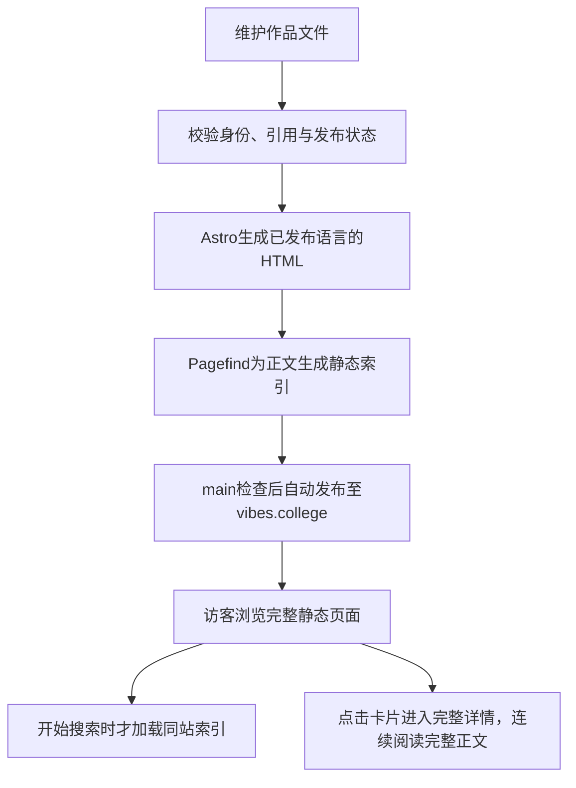

# VIBES项目总览

这些Markdown是给你阅读的代码说明：从这里看懂网站做什么、数据在哪里、操作怎样发生，再沿链接进入具体路径和对应源码。它们跟随代码维护；历史计划放specs，过程和合并状态看Git与PR。

## 项目定位与范围

**vibes.college is the campus for the AI economy, where people and agents learn, meet, trade, and build together.**

VIBES是AI经济的校园，让人和Agent认识AI、认识彼此、交易成果并共同创造。Explore关注两条线：Learn what’s shaping AI. Learn what’s changed by AI.

| 板块    | Slogan                      | 与当前代码的关系                            |
| ------- | --------------------------- | ------------------------------------------- |
| Explore | Discover and understand AI  | 当前网站唯一的产品板块                      |
| Market  | Buy and sell AI outcomes    | 愿景，没有页面或业务接口                    |
| Events  | Meet the people shaping AI  | 愿景，没有页面或业务接口                    |
| Tag     | Work with people and agents | 愿景，没有独立产品实现                      |
| Paseo   | 连接VIBES和你的本地Agent    | H/A1/A2隔离站有原生助手实验，默认构建不启用 |

Explore服务寻找AI应用场景、理解能力边界、了解塑造AI的人物、公司和成果的人。没有公众/Agent在线编辑、Markdown投稿、账号、收藏、评论、支付或协作；这些愿景不自动成为开发任务。

## 现在能完成什么

| 你关心的问题             | 看这里                                      | 主要代码                                               |
| ------------------------ | ------------------------------------------- | ------------------------------------------------------ |
| 访客怎样找到作品         | [浏览与搜索](features/explore-browse.md)    | src/components/Explore.astro、src/scripts/explore.ts   |
| 怎样阅读与继续探索       | [阅读详情](features/article-read.md)        | src/components/WorkDetail.astro、src/scripts/detail.ts |
| 怎样日常更新原文与译文   | [维护内容](features/content-maintenance.md) | src/lib/content/、scripts/validate-content.ts          |
| 怎样检查并发布到测试站   | [检查与发布](features/project-commands.md)  | scripts/release.ts、.github/workflows/check.yml        |
| 怎样让文档跟代码一起变化 | [维护文档](features/document-governance.md) | scripts/docs-check.ts、scripts/docs-sources.ts         |

中英文路由、原文先发布、译文复核状态和全文搜索均已实现；英文内容量取决于实际发布文件，不代表全部译文完成。当前数量以`npm run content:validate`输出为准，不在多篇文档手抄同一组易过期数字。几千条内容与日更是规模目标，日常编辑发布仍由维护者执行。

## 从内容到页面的链路

构建框架是Astro，语言是TypeScript，样式是普通CSS，正文复用Prose UI独立样式，并在构建时编译Markdown组件与公式。站内阅读使用Astro ClientRouter连续切换并有限预取详情，搜索仍按需加载；规则和缓存边界见[系统规则](system/rules.md)。普通文章继续使用.md；互动文章可选.mdx与按需React islands，维护方式见[内容维护](features/content-maintenance.md)。beUI组件使用构建期Tailwind样式与Motion动效；没有线上业务数据库；Node与依赖版本以[运行配置](system/configuration.md)所链接的package.json/锁文件为准。

访客请求不会触发登录、订单或内容提交服务。robots.txt和sitemap.xml也在构建时生成，并非动态业务接口；说明见[接口与外部服务](system/interfaces.md)。

## 产品要求放在哪里维护

- 发现、分类、搜索、语言目录及手机卡片行为归[浏览与搜索](features/explore-browse.md)。
- 手机优先的“顶部导航→作品概览→整屏正文”、常显正文、进度目录、分章表情评价、相邻手势和来源归[阅读详情](features/article-read.md)。
- 中英发布、可选事实、稳定身份及关联数据归[内容维护](features/content-maintenance.md)与[数据结构](system/content-model.md)。
- 中文界面显示中文分类，英文界面显示英文分类；“紧凑英文分类”是旧描述，不再当作当前两种语言共同规则。
- 外壳采用系统字体，正文采用Geist与本机中文字体、暖白背景和渐进阅读；借鉴Wikipedia的来源追溯、Are.na的内容关联及roadmap的清晰层级，不复制品牌或源码。参考图已移除，当前行为以功能文档和源码为准。

## 实现、验收与部署分开看

实现状态由当前代码及功能说明表达；最近一次有效验收在对应功能文档注明范围、日期和方法，不因文档排版就清空已通过记录。源码影响了结论时重新验证，不能仅刷新记录。

用户已授权正式目标为[vibes.college](https://vibes.college/zh/)。首版spec即建立Draft PR，阶段预览不提升生产；网站变更合并main且检查通过后自动部署，线上验收后再清理本任务资源。实际启用和上线状态以[交付说明](system/checks-and-release.md)、GitHub部署结果与线上版本为准，不能由配置或本地main推断。新流程版本证据在resources/evidence/releases/及CI artifact，旧测试站记录只作历史。

[规格索引](../specs/README.md)记录实现阶段与决定；合并状态看GitHub PR，不在每篇现状文档复制“待合并/已合并”流水账。

## 已确认的限制

- 相关作品的数据校验和双向读取已实现，但当前详情没有相关作品展示区；不是可见的关联推荐功能。
- 只有本地D1命令测试表；迁移SQL里的旧路径注释属于历史迁移，不是当前内容源，也不据此重写已经应用的迁移。
- 5000件双语内容的本地规模测量通过不等于免费托管容量足够；容量边界见[系统规则](system/rules.md)。
- 真机Safari、读屏等尚未做完整专项验收；平台分支保护状态需实时核对。
- 移除测试库、缩减发布工具、简化预览图等是可讨论的维护取舍，并非已批准开发任务。现有迁移工具仍用于fixture构建，不当作当前内容入口。

文件夹只分[用户路径](features/README.md)和系统说明；[文档地图](README.md)说明每份资料的职责，避免多个总览重复描述同一套代码。

原生助手的隔离体验及验收边界见[本地助手](features/local-assistant.md)；H不是正式发布候选。
