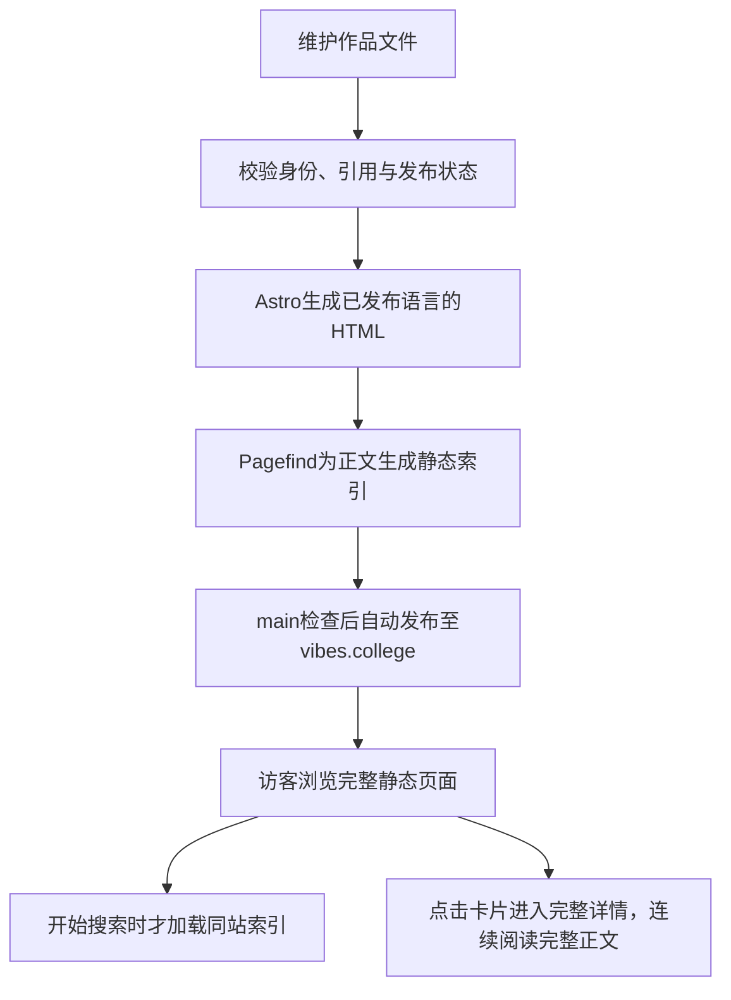

# VIBES项目总览

这些Markdown是给你阅读的代码说明：从这里看懂网站做什么、数据在哪里、操作怎样发生，再沿链接进入具体路径和对应源码。它们跟随代码维护；历史计划放specs，过程和合并状态看Git与PR。

## 项目定位与范围

**vibes.college is the campus for the AI economy, where people and agents learn, meet, trade, and build together.**

VIBES是AI经济的校园，让人和Agent认识AI、认识彼此、交易成果并共同创造。Explore关注两条线：Learn what’s shaping AI. Learn what’s changed by AI.

| 板块    | Slogan                      | 与当前代码的关系            |
| ------- | --------------------------- | --------------------------- |
| Explore | Discover and understand AI  | 当前网站唯一的产品板块      |
| Market  | Buy and sell AI outcomes    | 愿景，没有页面或业务接口    |
| Events  | Meet the people shaping AI  | 愿景，没有页面或业务接口    |
| Tag     | Work with people and agents | 愿景，没有独立产品实现      |
| Paseo   | 连接VIBES和你的本地Agent    | Explore内的可选原生本地助手 |

Explore服务寻找AI应用场景、理解能力边界、了解塑造AI的人物、公司和成果的人。没有公众/Agent在线编辑、Markdown投稿、账号、收藏、评论、支付或协作；这些愿景不自动成为开发任务。

## UI与UX学习内容方向

UI/UX内容面向希望与Agent协作、做出专业网页体验的人。用户掌握设计判断、表达、取舍与验证，Agent负责研究实现、编写代码、操作与修正；学习路径不要求用户阅读或手写原始代码，但需要理解实际运行的约束。Prompt是这些判断的表达方式，完整能力还包括理解用户、识别好设计、建立规则、对齐方向和检验结果。

当前选题聚焦网页UI与UX，不展开视频剪辑等其他领域。下表是已确认的内容选题与收录方向，不表示这些合集已经在网站建立；页面现状见[学习交互作品](features/great-ui-learning.md)。

| 大主题与合集方向                   | 核心知识与用户能力                                   | 与Agent协作的实际产物                              |
| ---------------------------------- | ---------------------------------------------------- | -------------------------------------------------- |
| Vibe Coding网页审美                | 视觉层次、比例、留白、配色、字体、密度与场景适配     | 有理由的参考选择、借鉴范围和审美反馈               |
| Vibe Coding网页排版                | 栅格、对齐、字号行高、阅读宽度、内容节奏和响应式布局 | 以真实内容为依据的桌面与手机布局要求               |
| Design Tokens：让Agent统一全站风格 | 颜色角色、字体层级、间距尺度、圆角、阴影与主题       | 可重复引用的设计规则与明确例外                     |
| Vibe Coding网页动效                | 触发、时长、缓动、弹性、错峰、滚动关联与空间连续性   | 可观察的运动顺序、适配要求与调整依据               |
| Vibe Coding交互组件                | 按钮、表单、导航、弹窗、选择器的行为、状态与组合     | 覆盖加载、禁用、错误、键盘和触屏的组件要求         |
| Vibe Coding UX设计                 | 用户任务、信息架构、操作流程、认知负担、反馈与恢复   | 可实际走通的任务路径、可用性观察与问题修正         |
| Vibe Coding产品文案                | 信息优先级、按钮命名、说明、空状态和错误提示         | 与真实任务一致、说明当前状态和下一步的界面内容     |
| AI原生产品交互                     | 流式结果、等待、不确定性、人工确认、中断、撤销和纠错 | 用户能审阅、控制和修正的AI协作过程                 |
| 与Agent对齐设计                    | 选参考、写设计说明、限定范围、比较方案和逐轮反馈     | 包含目标、上下文、参考、约束和检查要求的完整任务   |
| Vibe Coding网页验收与打磨          | 视觉还原、真实操作、响应式、可访问性、性能与异常     | 页面、截图或操作录屏等实际证据，以及有针对性的修正 |

优先展开网页动效、网页审美和Design Tokens；Agent协作贯穿各主题。主题存在知识交叉，具体案例归属、合集内分类与推荐顺序在内容策划时确定，不按来源库数量或技术实现形式机械划分。

### 精品收录与内容组织

- 坚持精品原则与no slop。上百个开源库或网站是选材范围，不构成逐库、逐件收录承诺。已有接入、录屏和说明也不能自动作为进入核心学习路径的资格。
- 每件公开案例都需说明它解决的实际问题、效果与实现依据、可迁移的方法、适用边界，以及相对已有内容新增的教学价值。相似外观或品牌替换不自动成为新的核心案例；更好的代表作可以替换原有选择。
- 内部候选资料与公开精选分开。案例数量由有效知识覆盖决定，不以凑齐目录、固定数量或规模指标降低标准。公开材料的深度可以不同，质量门槛保持一致。
- 合集使用用户能识别、愿意学习的技能主题，例如“Vibe Coding网页动效”；具体学习目标放在内部分类和章节中。来源、固定版本与许可用于溯源，不能替代合集自己的教学组织。
- 合集名称长期保持清楚；小红书、X等传播标题可围绕实际效果对比、常见困扰和可取得的成果展开。标题承诺需由真实案例和内容支持，不把夸张效果、空洞Prompt或批量模板当作教学价值。
- 共享原理集中维护，每件案例讲清本例的关键决定。案例、改造练习与串联任务各自提供实质内容，避免重复解释和为模板填充文字。

### 与Agent协作的学习路径

学习按“看懂参考→明确目标→对齐方向→约束实现→观察结果→定向修改→保留规则”展开。用户先辨认参考中值得借鉴的部分，结合自己的页面、内容和受众说明目标；把既有样式、组件、设备和行为边界带入任务；Agent实施后提供真实结果，用户依据证据调整并保留确认过的规则。

验收材料应与学习目标对应：截图帮助判断排版，实际操作帮助判断行为，慢加载和失败场景帮助判断恢复。自动检查与人的观察各自说明覆盖范围；Agent的完成声明不能代替运行结果。具体检查与发布仍遵循[交付规则](system/checks-and-release.md)，这些学习主题不自动启动实施或额外验收。

## 现在能完成什么

| 你关心的问题             | 看这里                                      | 主要代码                                               |
| ------------------------ | ------------------------------------------- | ------------------------------------------------------ |
| 访客怎样找到作品         | [浏览与搜索](features/explore-browse.md)    | src/components/Explore.astro、src/scripts/explore.ts   |
| 怎样阅读与继续探索       | [阅读详情](features/article-read.md)        | src/components/WorkDetail.astro、src/scripts/detail.ts |
| 怎样和自己的Agent做事    | [使用本地助手](features/local-assistant.md) | src/features/paseo-webui/、third_party/paseo-webui/    |
| 怎样日常更新原文与译文   | [维护内容](features/content-maintenance.md) | src/lib/content/、scripts/validate-content.ts          |
| 怎样检查并发布网站       | [检查与发布](features/project-commands.md)  | scripts/release.ts、.github/workflows/check.yml        |
| 怎样让文档跟代码一起变化 | [维护文档](features/document-governance.md) | scripts/docs-check.ts、scripts/docs-sources.ts         |

中英文路由、原文先发布、译文复核状态和全文搜索均已实现；英文内容量取决于实际发布文件，不代表全部译文完成。当前数量以`npm run content:validate`输出为准，不在多篇文档手抄同一组易过期数字。几千条内容与日更是规模目标，文章可通过GitHub PR贡献，维护者审阅合并后发布；[内容贡献流程](system/content-contributions.md)说明独立检查与预览。

Explore中的[Great UI交互学习](features/great-ui-learning.md)以一个合集连接48件独立详情，可看本站录屏、改造目标和任务，并体验三条组合。说明以Markdown维护，通用解释引用[共享术语库](../src/content/glossary/README.md)；站内页面与辅助本地工作台读取同一来源。

## 从内容到页面的链路

构建框架是Astro，语言是TypeScript，样式是普通CSS，正文复用Prose UI独立样式，并在构建时编译Markdown组件与公式。站内阅读使用Astro ClientRouter连续切换并有限预取详情，搜索仍按需加载；规则和缓存边界见[系统规则](system/rules.md)。普通文章继续使用.md；互动文章可选.mdx与按需React islands，维护方式见[内容维护](features/content-maintenance.md)。beUI组件使用构建期Tailwind样式与Motion动效；没有线上业务数据库；Node与依赖版本以[运行配置](system/configuration.md)所链接的package.json/锁文件为准。

访客请求不会触发登录、订单或内容提交服务。robots.txt和sitemap.xml也在构建时生成，并非动态业务接口；说明见[接口与外部服务](system/interfaces.md)。

访客可主动打开Paseo助手，配对自己的电脑后对话、执行并查看原生产出。首次无工作区时准备`~/Vibes/Chat`，以后沿用原生当前项目；Agent和模型由用户通过原生入口选择或恢复已有偏好，不要求Codex或ChatGPT订阅。小窗只显示对话，全屏提供项目、历史和文件入口，文章入口可带入能删除的公开链接引用。小窗提供本地英语听写路径，真实麦克风与手机仍需验收。助手不提供云端执行或模型账号，不启用网站投稿和编辑。配对、会话、审批和文件沿用Paseo原生实现，宿主管理加载和阅读布局；尚缺的工作区快捷入口、插件运行及完整验收见[使用本地助手](features/local-assistant.md)，来源及维护见[Paseo接入](system/local-assistant.md)。

## 产品要求放在哪里维护

- 发现、分类、搜索、语言目录及手机卡片行为归[浏览与搜索](features/explore-browse.md)。
- 手机优先的“顶部导航→作品概览→整屏正文”、常显正文、进度目录、分章表情评价、相邻手势和来源归[阅读详情](features/article-read.md)。
- 中英发布、可选事实、稳定身份及关联数据归[内容维护](features/content-maintenance.md)与[数据结构](system/content-model.md)。
- 中文界面显示中文分类，英文界面显示英文分类；“紧凑英文分类”是旧描述，不再当作当前两种语言共同规则。
- 外壳采用系统字体，正文采用Geist与本机中文字体、暖白背景和渐进阅读；借鉴Wikipedia的来源追溯、Are.na的内容关联及roadmap的清晰层级，不复制品牌或源码。参考图已移除，当前行为以功能文档和源码为准。

## 实现、验收与部署分开看

实现状态由当前代码及功能说明表达；最近一次有效验收在对应功能文档注明范围、日期和方法，不因文档排版就清空已通过记录。源码影响了结论时重新验证，不能仅刷新记录。

用户已授权正式目标为[vibes.college](https://vibes.college/zh/)。首版spec即建立Draft PR，阶段预览不提升生产；网站变更合并main且检查通过后自动部署，线上验收后再清理本任务资源。实际启用和上线状态以[交付说明](system/checks-and-release.md)、GitHub部署结果与线上版本为准，不能由配置或本地main推断。新流程版本证据在resources/evidence/releases/及CI artifact，旧测试站记录只作历史。

[规格索引](../specs/README.md)记录实现阶段与决定；合并状态看GitHub PR，不在每篇现状文档复制“待合并/已合并”流水账。

## 已确认的限制

- 相关作品的数据校验和双向读取已实现，但当前详情没有相关作品展示区；不是可见的关联推荐功能。
- 只有本地D1命令测试表；迁移SQL里的旧路径注释属于历史迁移，不是当前内容源，也不据此重写已经应用的迁移。
- 5000件双语内容的本地规模测量通过不等于免费托管容量足够；容量边界见[系统规则](system/rules.md)。
- 真机Safari、读屏等尚未做完整专项验收；平台分支保护状态需实时核对。
- 移除测试库、缩减发布工具、简化预览图等是可讨论的维护取舍，并非已批准开发任务。现有迁移工具仍用于fixture构建，不当作当前内容入口。

文件夹只分[用户路径](features/README.md)和系统说明；[文档地图](README.md)说明每份资料的职责，避免多个总览重复描述同一套代码。
