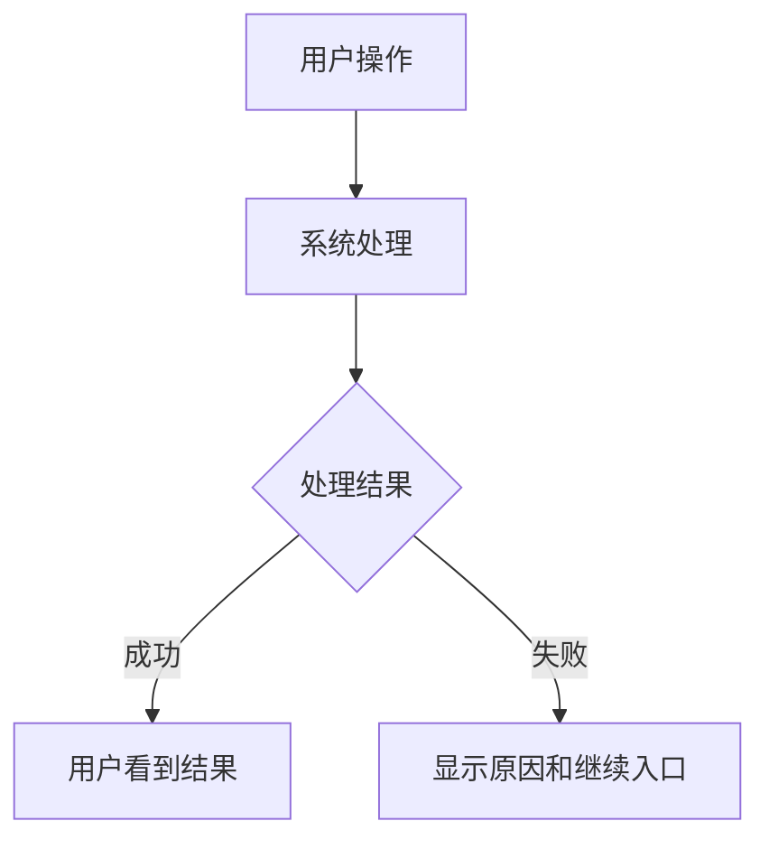

# 功能名：功能名称

## 一句话说明

谁通过什么操作，得到什么结果。一个文档描述一项完整的用户任务，不按组件、样式或技术层拆分；维护者使用的能力放到维护分组。

## 用户操作路径

1. 从哪个网址或入口开始。
2. 输入什么、点击什么；维护功能写实际文件和命令。
3. 成功后到哪里、看到什么。
4. 失败或没有结果时看到什么，如何继续。

### 操作之后发生什么（按需）

复杂或容易误解的路径，用简短流程图解释“用户动作→系统响应→可见结果”；成功与失败分支写实际行为。下面只是结构占位，不是任何功能的已实现流程；重写为当前代码的真实顺序，简单路径可省略。

图后只解释影响理解的时机和边界，并指向关键源码。不照搬参考图的框架、接口或事件名，不在每篇文档机械塞图。

## 涉及的文件

- 页面：列真实完整的仓库相对路径。
- 交互或接口：列本功能实际使用的文件，没有就不列。
- 数据：列内容文件或表名；字段细节链接到对应技术文档，不重复抄写。

## 验收标准

- [ ] 正常操作得到预期结果。
- [ ] 无效输入、空结果或失败时有明确反馈。
- [ ] 本功能实际涉及的手机、语言、权限等边界行为正确。

每项写成可以观察的结果。只有本次实际验证后才勾选，并注明日期、环境与方法；未勾选表示尚未在本次验收，不等于功能没有实现。以前的证据可标明日期引用，不当作本次通过。

## 对应的自动化测试

列真实测试文件和对应测试名称；没有覆盖时写“暂无自动化测试”，说明需要怎样人工验证。测试存在不等于本次运行通过。

## 依赖的其他功能

列完成这条路径必须依赖的功能链接；没有就写“无”。框架和npm依赖放技术文档。

## 已知问题 / 待办

写已确认的限制、缺陷或尚未完成的验收；没有就写“无”。不把可能有用的想法写成已批准需求。
