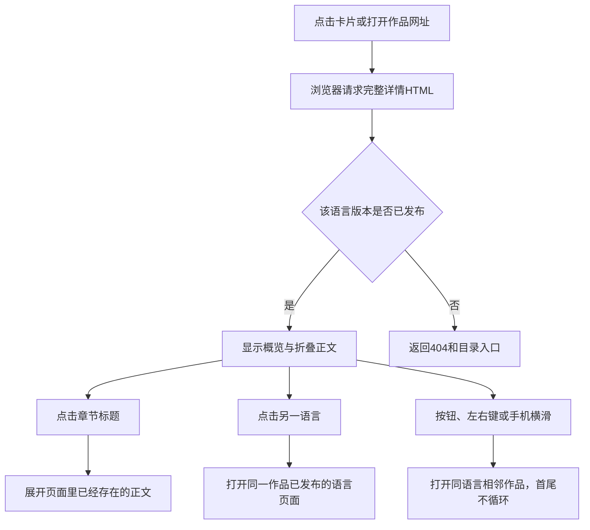

# 功能名：阅读作品详情

## 一句话说明

访客从作品概览进入正文，查阅来源，并继续阅读相邻作品或同一作品的另一语言版本。

## 用户操作路径

1. 从目录点击卡片，进入`/{locale}/works/{id}/`，先看来源、预览、标题、介绍和已有的作者/类型等信息。
2. 点击原站链接，在新标签页打开原始作品；预览封面不是内嵌播放器。
3. 点向下阅读入口，选择章节标题展开或收起正文，阅读文字、表格和来源链接。
4. 点击有链接的信息项，进入同类作品或对应正文；没有有效目标的信息只显示文字。
5. 通过上一件、下一件按钮继续阅读；电脑可用左右键，手机可横滑。第一件和最后一件不会循环跳转。
6. 切换语言时仍然阅读同一作品；没有已发布译文时提示暂无译文，原文仍可读。译文待复核时显示提示和原文入口。
7. 点Explore返回同语言目录；同标签页访问时恢复之前的分类和关键词。直接打开不存在的作品或译文地址会得到404。

### 操作之后发生什么

正文在构建时已转为HTML，展开章节不再向服务器请求正文；原生折叠控件不依赖JavaScript。语言和相邻作品切换是完整页面导航。对应`src/components/WorkDetail.astro`、`src/data/article-sections.ts`和`src/scripts/detail.ts`。

## 涉及的文件

- 页面：`src/pages/[locale]/works/[id].astro`、`src/components/WorkDetail.astro`、`src/components/LanguageSwitch.astro`。
- 正文与信息：`src/data/article-sections.ts`、`src/data/work-facts.ts`、`src/lib/content/relations.ts`。
- 操作与排版：`src/scripts/detail.ts`、`src/styles/detail.css`、`src/styles/article.css`。
- 语言状态：`src/lib/content/revision.ts`、`src/lib/content/views.ts`；内容来自`src/content/works/`。

## 验收标准

- [ ] 卡片和直接网址都能打开完整详情，原站链接在新标签页打开。
- [ ] 章节可展开收起，表格、三级标题、来源和正文锚点保留。
- [ ] 无JavaScript时仍可阅读正文、展开章节和用按钮切换作品。
- [ ] 按钮、左右键和手机横滑能切换同语言的相邻作品，首尾不循环。
- [ ] 表格、代码和输入区域的操作不误触作品切换。
- [ ] 语言切换保持作品身份；缺失译文不生成假页面。
- [ ] 旧译文待复核、事实没有译文时有明确提示。
- [ ] 320px宽度无整页横向溢出，宽表格在自身区域滚动。

本次未重新执行网页验收。历史证据：2026-09-05本地Playwright桌面/手机模拟验证阅读、切换和语言边界；2026-09-06 ego-browser验证实际正文展开和中英切换。键盘完整路径、读屏和所有手势排除区域没有完整专项验收，不据此勾选。

## 对应的自动化测试

`tests/explore.spec.ts`：

- `standalone detail is readable with JavaScript disabled`
- `detail overview, disclosure, and adjacent navigation`
- `touch swipe navigates to the next work and the previous button returns`
- `published languages switch the same work and missing translations remain absent`
- `no horizontal overflow, no embeds, two-line card descriptions`

`tests/unit/article-sections.test.ts`验证正文结构；`tests/unit/content-relations.test.ts`验证事实/关联；`tests/content-lifecycle.spec.ts`验证译文发布及待复核的真实构建。

## 依赖的其他功能

- [维护作品内容](content-maintenance.md)：提供正文、事实与译文状态。
- [浏览与搜索作品](explore-browse.md)：提供阅读入口及返回目录。

## 已知问题 / 待办

手机触摸测试使用Chromium模拟；真机Safari和读屏尚未完成专项验收。未提供的事实不会自动补全；来源与内容质量仍需编辑判断。
