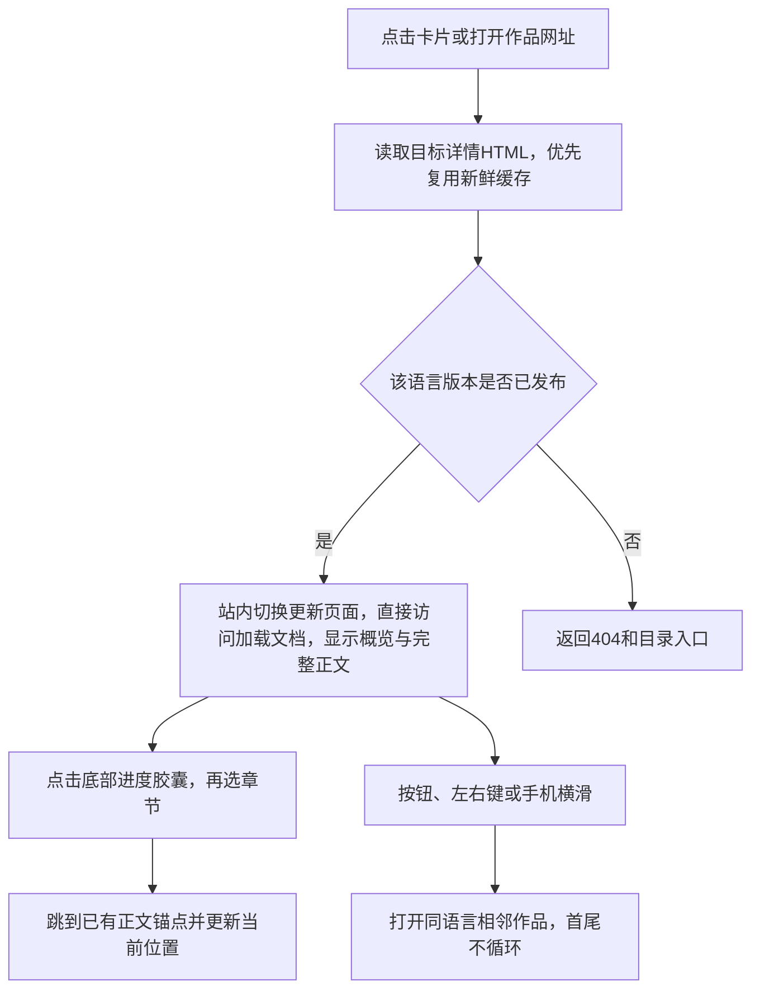

# 功能名：阅读作品详情

## 一句话说明

访客在作品概览与正文之间整屏翻阅，连续阅读正文并用进度目录跳转，并继续阅读相邻作品。

## 用户操作路径

1. 从目录点击卡片，进入`/{locale}/works/{id}/`，先看来源、预览、标题、介绍和已有的作者/类型等信息。
2. 点击原站链接，在新标签页打开原始作品；预览封面不是内嵌播放器。
3. 上下滑动或点轻微摆动的向下入口，在概览与正文两屏间停靠；正文全部展开，长正文正常滚动。底部进度胶囊只在正文出现，显示阅读进度与当前章；点击展开目录并跳转，Escape或点外部关闭。
4. 点击有链接的信息项，进入同类作品或对应正文；没有有效目标的信息只显示文字。
5. 顶部依次为交叉关闭、上一件、下一件，随概览滚走，正文不悬浮保留；电脑可用左右键，手机可横滑。横滑或空白长按显示边缘方向提示，随触点上下移动；明确横移后松手切换，取消或只长按不切换。首尾不循环。
6. 详情不显示中英切换、缺译提示或查看原文入口；可返回首页选择语言。已有语言网址仍可直接打开，待复核译文保留状态文字。
7. 点顶部交叉按钮返回同语言目录；同标签页访问时恢复之前的分类和关键词。直接打开不存在的作品或译文地址会得到404。

### 操作之后发生什么

正文在构建时已转为HTML，目录不再请求正文；无脚本保留全部正文、CSS整屏停靠与真实导航，进度胶囊隐藏。正文不显示序号、折叠按钮、引导语或重复的底部原站入口；来源链接仍属于文章内容。标题保持完整原意，以18–20px排版；通用章节用短导航名，其他长名称在胶囊省略、目录换行。胶囊接近正文时才初始化，不在封面首屏测量章节；尺寸有可取消回弹，文字交叉淡入，目录逐项出现，圆环平滑追随；减少动态偏好即时更新。进度按正文顶部到正文底部进入视口计算，缩放与尺寸变化重新校准，页面离开清理监听和动画。站内链接和相邻作品通过Astro ClientRouter保留运行环境并更新页面、标题与网址；相邻切换带短距离方向过渡，导航失败回退普通打开。可见相邻链接会提前准备；见[预取与缓存](../system/rules.md)。

## 涉及的文件

- 页面：`src/pages/[locale]/works/[id].astro`、`src/components/WorkDetail.astro`。
- 正文与信息：`src/data/article-sections.ts`、`src/data/work-facts.ts`、`src/lib/content/relations.ts`。
- 操作与排版：`src/scripts/detail.ts`及其手势、阅读进度与切换模块、`src/styles/detail.css`、`src/styles/article.css`。
- 语言状态：`src/lib/content/revision.ts`、`src/lib/content/views.ts`；内容来自`src/content/works/`。

## 验收标准

- [x] 卡片和直接网址都能打开完整详情，原站链接在新标签页打开。
- [x] 正文全部可读，进度目录支持章节跳转；表格、三级标题、来源和正文锚点保留。
- [x] 无JavaScript时仍可阅读全部正文和用按钮切换作品。
- [x] 按钮、左右键和手机横滑能切换同语言的相邻作品，首尾不循环。
- [ ] 表格、代码和输入区域的操作不误触作品切换（已实现排除规则，缺完整专项验收）。
- [x] 详情无语言控件，首页可选择语言；已发布译文网址可读，缺译地址404。
- [x] 旧译文待复核、事实没有译文时有明确提示。
- [x] 320px宽度无整页横向溢出，宽表格在自身区域滚动。

连续阅读的历史滚动、反复搜索与语言切换由`tests/navigation.spec.ts`覆盖；旧页面监听与未完成搜索在切换时失效。

最近有效验收：2026-09-06 Playwright桌面Chromium、手机Chromium/WebKit覆盖常显正文、进度目录、锚点、Escape/外部关闭、减少动画、两屏停靠、相邻切换、首页语言和历史。完整verify通过（52项单元测试、81项浏览器测试，3项设备适用性跳过），budget通过（全站脚本gzip 14,917字节，限额15,000）。内置浏览器核对390px手机正文与目录，并与Rare UI相同视口参考对照。Chromium手机使用原生触摸；WebKit横滑为DOM事件、停靠使用scrollTo。原始截图、加载与滚动比较在`resources/evidence/006-detail-reading/`，性能样本仅代表同机模拟环境，不能证明所有设备零影响；真机与读屏尚未专项验收。005目录历史证据保留原目录。

## 对应的自动化测试

`tests/explore.spec.ts`：

- `standalone detail is readable with JavaScript disabled`
- `detail overview, continuous reading, and adjacent navigation`
- `touch swipe navigates to the next work and the previous button returns`
- `homepage switches language and detail omits language controls while routes stay valid`
- `detail progress menu preserves anchors, keyboard, reversal and reduced motion`
- `edge feedback follows locked gestures and cancellation never navigates`
- `no horizontal overflow, no embeds, two-line card descriptions`

`tests/unit/article-sections.test.ts`验证正文结构；`tests/unit/content-relations.test.ts`验证事实/关联；`tests/content-lifecycle.spec.ts`验证译文发布及待复核的真实构建。

## 依赖的其他功能

- [维护作品内容](content-maintenance.md)：提供正文、事实与译文状态。
- [浏览与搜索作品](explore-browse.md)：提供阅读入口及返回目录。

## 已知问题 / 待办

手机触摸测试使用Chromium和WebKit模拟；真机Safari和读屏尚未完成专项验收。未提供的事实不会自动补全；来源与内容质量仍需编辑判断。
