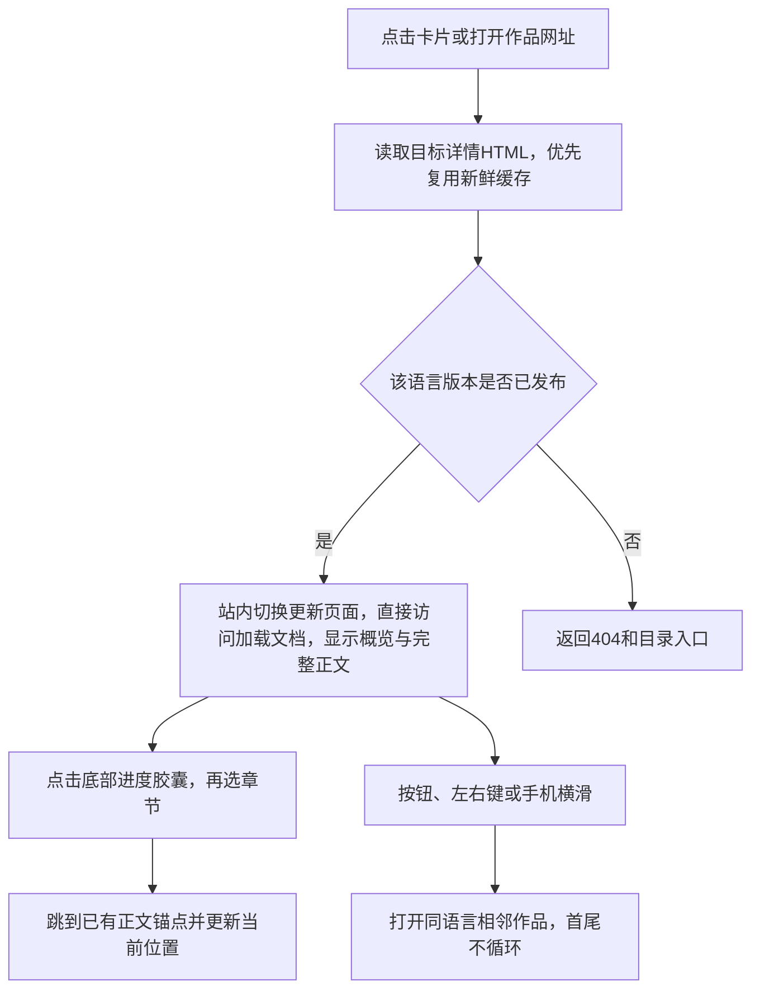

# 功能名：阅读作品详情

## 一句话说明

访客在作品概览与正文之间整屏翻阅，连续阅读正文并用进度目录跳转，并继续阅读相邻作品。

## 用户操作路径

1. 从目录点击卡片，进入`/{locale}/works/{id}/`，先看来源、预览、标题、介绍和已有的作者/类型等信息。
2. 点击原站链接，在新标签页打开原始作品；预览封面不是内嵌播放器。
3. 上下滑动或点轻微摆动的向下入口，在概览与正文两个独立页面之间切换：单指移动至少72px后松手翻页，较短或取消则留在当前页；换页有280ms短幅位移淡入。未显示的页面退出布局，不存在两页之间的位置或滚动吸附。较长概览先正常滚到末尾；正文全部展开并使用浏览器原生滚动，在正文顶部向下滑可返回概览。底部进度胶囊只在正文出现，显示阅读进度与当前章；点击展开目录并跳转，Escape或点外部关闭。
4. 点击章节标题右上角的小表情，展开五个选项；选择后逐个飘出，第一章向下飘，其他章按顶部空间调整。可按住入口拖到表情松开，或长按表情连续发射。每章选择只在当前浏览器保存，刷新后恢复。点入口、外部或Escape关闭；方向键选择，减少动态偏好不发射。
5. 点击有链接的信息项，进入同类作品或对应正文；没有有效目标的信息只显示文字。
6. 顶部依次为交叉关闭、上一件、下一件，仅在概览显示，进入正文后隐藏；电脑可用左右键，手机可横滑。横滑或空白长按显示边缘方向提示，随触点上下移动；明确横移后松手切换，取消或只长按不切换。首尾不循环。
7. 详情不显示中英切换、缺译提示或查看原文入口；可返回首页选择语言。已有语言网址仍可直接打开，待复核译文保留状态文字。
8. 在正文时先回到正文顶部向下滑返回概览，或用浏览器返回；再点概览顶部交叉按钮返回同语言目录；同标签页访问时恢复之前的分类和关键词。直接打开不存在的作品或译文地址会得到404。

### 正文中的排版与操作

正文使用Prose UI组件样式，阅读底色为暖白#FCFBF8、正文与标题为暖灰#2E2B29。拉丁字母使用Geist，中文在Apple设备优先苹方，其他平台回退本机中文字体；组件提示色保留原版。标题1–6、引用、列表、图片、卡片、步骤、代码、标签、公式和表格都可直接阅读。

代码右上角可复制当前内容；成功显示勾号3秒，失败提示手动选择。CodeGroup先选文件，再选语言；同组Tabs共享选项，代码语言在支持该语言的组间同步，刷新恢复。标签用左右键与Home/End切换，语言菜单用上下键与Escape；内容区域内方向键不切换作品。图片默认点击放大，Escape、关闭按钮或画面可返回并恢复焦点；行内图片默认不放大，链接图片保持打开链接。

[排版全览文章](../../src/content/works/prose-ui-showcase/zh.md)覆盖公开组件变体，作为Vibes原创验收文章显示在中文目录；没有英文译文。无JS时各标签/代码面板连续展示，复制与放大不启用；公式仍是静态可读内容。宽表格、长代码和块级公式各自在自己的区域内滚动。写法与参数见[Markdown排版](../system/markdown.md)。

### 操作之后发生什么

正文在构建时已转为HTML，目录不再请求正文；无脚本保留全部正文、CSS两屏停靠与真实导航，进度胶囊隐藏。正文不显示序号、折叠按钮、引导语或重复的底部原站入口；来源链接仍属于文章内容。标题保持完整原意，以Prose UI层级排版；通用章节用短导航名，其他长名称在胶囊省略、目录换行。胶囊接近正文时才初始化，不在封面首屏测量章节；尺寸有可取消回弹，文字交叉淡入，目录逐项出现，圆环平滑追随；减少动态偏好即时更新。进度按正文顶部到正文底部进入视口计算，缩放与尺寸变化重新校准，页面离开清理监听和动画。站内链接和相邻作品通过Astro ClientRouter保留运行环境并更新页面、标题与网址；相邻切换带短距离方向过渡，导航失败回退普通打开。可见相邻链接会提前准备；见[预取与缓存](../system/rules.md)。

表情菜单与动画模块在整页加载完成、进入正文停留1.5秒后的空闲时预加载，省流量模式仅点击加载，提前点击立即加载。预加载不创建工具条、不运行动画；全页共享一个工具条，最多40个粒子，关闭、滚轮操作、离开或进入后台清理；其他滚动时工具条随标题移动，标题离开视口则关闭。无JS时隐藏入口；存储受限时当次仍可使用，无法跨刷新保存。系统emoji在不同平台外观可能不同，不请求第三方图片。

## 涉及的文件

分章表情：`SectionReaction.astro`保留标题结构并定位小入口，`reaction-entry.ts`负责恢复选择与延迟加载，`section-reactions.ts`负责工具条、输入、保存与动画，`section-reactions.css`负责排版。

- 页面：`src/pages/[locale]/works/[id].astro`、`src/components/WorkDetail.astro`。
- 正文与信息：`src/data/article-sections.ts`、`src/data/work-facts.ts`、`src/lib/content/relations.ts`。
- 操作与排版：`src/scripts/detail.ts`及其横向手势、`detail-paging.ts`纵向整页过渡、阅读进度与切换模块、`src/styles/detail.css`、`src/styles/article.css`。
- 语言状态：`src/lib/content/revision.ts`、`src/lib/content/views.ts`；内容来自`src/content/works/`。

## 验收标准

- [x] 卡片和直接网址都能打开完整详情，原站链接在新标签页打开。
- [x] 正文全部可读，进度目录支持章节跳转；表格、三级标题、来源和正文锚点保留。
- [x] 无JavaScript时仍可阅读全部正文和用按钮切换作品。
- [x] 按钮、左右键和手机横滑能切换同语言的相邻作品，首尾不循环。
- [ ] 表格、代码和输入区域的操作不误触作品切换（已实现排除规则，缺完整专项验收）。
- [x] 详情无语言控件，首页可选择语言；已发布译文网址可读，缺译地址404。
- [x] 旧译文待复核、事实没有译文时有明确提示。
- [x] 320px宽度无整页横向溢出，宽表格在自身区域滚动。
- [x] 每章表情独立保存，刷新恢复；键盘、拖选、长按、受限存储、减少动态和换页清理可用。
- [x] 封面不加载表情主体，正文空闲准备；省流量仅点击，提前点击立即加载。

连续阅读的历史滚动、反复搜索与语言切换由`tests/navigation.spec.ts`覆盖；旧页面监听与未完成搜索在切换时失效。

最近有效验收：2026-09-06 Playwright桌面Chromium、手机Chromium/WebKit覆盖常显正文、进度目录、锚点、Escape/外部关闭、减少动画、入口对齐、相邻切换、首页语言和历史。底部连续滚动、视口尺寸变化后保留末章及返回正文顶部由回归覆盖。完整verify/budget与发布记录保存在证据目录；脚本预算见[系统规则](../system/rules.md)。内置浏览器核对390px手机正文与目录，并与Rare UI相同视口参考对照。Chromium手机使用原生触摸；WebKit手势为DOM事件、长正文使用程序滚动。原始截图、加载与滚动比较在`resources/evidence/006-detail-reading/`，性能样本仅代表同机模拟环境，不能证明所有设备零影响；真机与读屏尚未专项验收。005目录历史证据保留原目录。

分章评价有效验收：2026-09-06完整发布检查通过52项单测、96项浏览器测试（3项设备适用性跳过）及budget；内置浏览器在Cloudflare预览390px宽度实际选择与刷新，已恢复原表情、无整页溢出和控制台错误。表情主体约2.1KB延后，首开脚本增量约1.35KB；详细测量与限制见[007研究](../../specs/007-section-reactions/research.md)，原始证据在`resources/evidence/007-section-reactions/`。

排版专项验收：2026-09-06，编译单测覆盖所有组件、属性错误、错误公式、图像尺寸与章节完整性；Playwright专项覆盖同步/复制、禁用JS、320px、图片键盘关闭与存储受限。完整verify通过61项单测、111项浏览器测试（3项设备适用性跳过），budget通过；Cloudflare预览已实际核对复制、同步、图片关闭、暖白背景与控制台。截图对照与限制见`resources/evidence/008-prose-markdown/design-qa.md`，发布证据见同目录及PR。

## 对应的自动化测试

`tests/explore.spec.ts`：

- `standalone detail is readable with JavaScript disabled`
- `detail overview, continuous reading, and adjacent navigation`
- `touch swipe navigates to the next work and the previous button returns`
- `homepage switches language and detail omits language controls while routes stay valid`
- `detail progress menu preserves anchors, keyboard, reversal and reduced motion`
- `edge feedback follows locked gestures and cancellation never navigates`
- `reading bottom stays put after repeated overscroll and viewport changes`
- `no horizontal overflow, no embeds, two-line card descriptions`

`tests/prose.spec.ts`覆盖排版交互与窄屏/无JS；`tests/unit/prose-markdown.test.ts`使用真实Astro编译器验证语法、错误和全部示例。

`tests/reactions.spec.ts`覆盖加载时机、省流量、独立保存、键盘、320px边界、减少动态、受限存储与长按清理。

`tests/unit/article-sections.test.ts`验证正文结构；`tests/unit/content-relations.test.ts`验证事实/关联；`tests/content-lifecycle.spec.ts`验证译文发布及待复核的真实构建。

## 依赖的其他功能

- [维护作品内容](content-maintenance.md)：提供正文、事实与译文状态。
- [浏览与搜索作品](explore-browse.md)：提供阅读入口及返回目录。

独立页面回归：2026-09-07，当前取消全部滚动吸附；验证轻滑不翻、明确翻页、反向返回、取消、多指、进入正文后等待与视口高度变化，以及正文底部滚动。Chromium使用原生触摸，WebKit使用DOM事件；不能代替真实iPhone惯性及地址栏表现。证据在`resources/evidence/006-detail-reading/independent-pages/`。

## 已知问题 / 待办

iOS 26 Safari旧吸附实现曾出现正文回封面；当前已改为独立页面，真机复测仍待确认。读屏尚未完成专项验收。未提供的事实不会自动补全；来源与内容质量仍需编辑判断。
