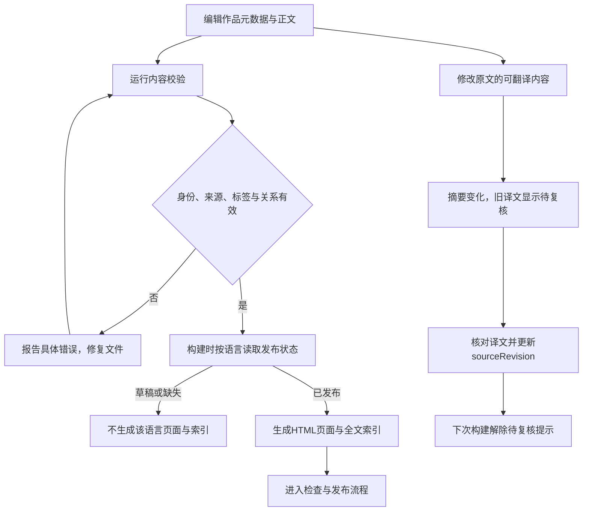

# 功能名：维护作品内容

## 一句话说明

维护者通过AI编辑作品文件，校验原文与译文后，把要发布的内容交给网站发布流程。

## 用户操作路径

1. 明确要新增或修改的作品、可靠来源和原文语言，让AI编辑`src/content/works/{id}/work.json`与`zh.md`或`en.md`；网站没有编辑后台。
2. 填写稳定ID、顺序、来源、预览和实际可提供的信息；标签使用`src/data/taxonomy.json`，不要把同一作品改名成另一个身份。
3. 保存正文并设置`draft`或`published`；草稿不生成页面或搜索结果，原文可先于译文发布。
4. 如需关联作品，只记录一次相似/归组/比较关系，双方都可读；不表达继承或业务依赖。
5. 运行`npm run content:validate`。成功会报告目录状态；有错误则根据提示修复，不进入构建发布。
6. 发布译文前核对全文，运行`npm run content:revision -- <id>`取得原文摘要，再填写`sourceRevision`和发布状态；命令不会替你审核或自动修改文件。
7. 原文更新后，旧译文继续可读但提示待复核；重新核对译文并更新摘要后解除提示。
8. 进入[检查与发布网站](project-commands.md)，通过检查并发布后再核对线上页面和搜索。

### 操作之后发生什么

校验命令只报告问题；修改文件或把状态写成published都不会直接改变线上网站。网站更新仍需构建与发布。对应`src/lib/content/revision.ts`、`scripts/validate-content.ts`和`scripts/build.ts`。

## 涉及的文件

- 内容：`src/content/works/{id}/work.json`、`src/content/works/{id}/zh.md`、`src/content/works/{id}/en.md`，其中`{id}`是作品目录占位符；现有示例为`src/content/works/attention-is-all-you-need/`。
- 分类：`src/data/taxonomy.json`。
- 内容规则：`src/lib/content/schema.ts`、`src/lib/content/catalog.ts`、`src/lib/content/validate.ts`、`src/lib/content/revision.ts`、`src/lib/content/relations.ts`、`src/lib/content/views.ts`。
- 读取和校验：`src/content.config.ts`、`scripts/validate-content.ts`、`scripts/build.ts`。
- 字段与命令边界见[规则](../technical/CONSTANTS.md)和[CLI](../operations/CLI.md)。网站内容不存入D1。

## 验收标准

- [ ] 合法原文可独立发布；草稿与缺失译文不出现在页面和索引中。
- [ ] 重复ID/顺序、目录身份错误、缺失原文或无效来源/标签得到明确错误。
- [ ] 自关联、反向重复关联和无效事实目标被拒绝；有效关联双方可读。
- [ ] 原文正文与可翻译信息更新触发译文待复核，单纯排序变化不触发。
- [ ] 核对译文并更新摘要后解除待复核提示，命令本身不自动批准发布。
- [ ] 全部草稿或空目录可以构建，且不残留旧搜索索引。

本次未重新执行内容发布验收。历史证据：2026-09-05单元测试、七阶段隔离构建及独立测试站内容修订/恢复通过；记录在`resources/evidence/001-multilingual-explore/`。

## 对应的自动化测试

- `tests/unit/content.test.ts`：真实作品身份、正文和HTTPS来源。
- `tests/unit/content-validation.test.ts`：内容格式与跨文件约束。
- `tests/unit/content-revision.test.ts`：摘要与待复核状态。
- `tests/unit/content-relations.test.ts`：事实与双向关系。
- `tests/unit/i18n.test.ts`：发布语言、路径与分页。
- `tests/content-lifecycle.spec.ts`中的`isolated builds preserve original-first publication and translation review lifecycle`：实际构建的草稿、发布、待复核与零发布阶段。

## 依赖的其他功能

[检查与发布网站](project-commands.md)：让文件改动经过检查并上线。

## 已知问题 / 待办

来源真实性、使用授权和翻译质量必须由编辑核对，自动校验无法证明。当前中文24件，英文仅一件AI逐段审核样例，不代表全部翻译完成或人工审核。没有公众投稿、在线编辑或自动发布译文功能。
