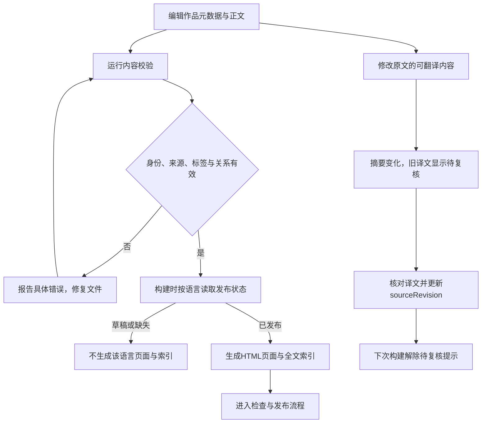

# 功能名：维护作品内容

## 一句话说明

维护者通过AI编辑作品文件，校验原文与译文后，把要发布的内容交给网站发布流程。

## 用户操作路径

可直接从文章的GitHub编辑入口提出改进PR，完整操作、检查分类、预览和失败处理见[GitHub内容贡献](../system/content-contributions.md)。正文及批准MDX组件组合走内容通道；新增可执行代码仍完整验收。

1. 明确要新增或修改的作品、可靠来源和原文语言，让AI编辑`src/content/works/{id}/work.json`与`zh.md`或`en.md`（需要交互时用同名`.mdx`）；网站没有编辑后台。
2. 图表数据先核对来源并保存到public/media下的JSON或CSV文件，dataset填写对应/media路径，不填写远程URL。填写稳定ID、顺序、来源、预览和实际可提供的信息；标签使用`src/data/taxonomy.json`，不要把同一作品改名成另一个身份。
3. 大多数文章用普通Markdown写正文，复杂内容按[Markdown组件写法](../system/markdown.md)加入提示、卡片、步骤、代码组、标签或公式；完整示例为`src/content/works/prose-ui-showcase/zh.md`。保存正文并设置`draft`或`published`；草稿不生成页面或搜索结果，原文可先于译文发布。
4. 如需关联作品，只记录一次相似/归组/比较关系，程序可从任意一方读取关系；当前详情没有关联作品区域，不表达继承或业务依赖。
5. 运行`npm run content:validate`。成功会报告目录状态；有错误则根据提示修复，不进入构建发布。
6. 发布译文前核对全文，运行`npm run content:revision -- <id>`取得原文摘要，再填写`sourceRevision`和发布状态；命令不会替你审核或自动修改文件。
7. 原文更新后，旧译文继续可读但提示待复核；重新核对译文并更新摘要后解除提示。
8. 进入[检查与发布网站](project-commands.md)，通过检查并发布后再核对线上页面和搜索。

首次准备维护环境时，网站构建还需按[检查与发布网站](project-commands.md)准备固定Paseo产物；内容校验本身不需要连接电脑或模型账号。

### 维护网页动效与交互学习材料

从学习页顶部编辑图标进入该语言的GitHub编辑页，修改一份Markdown的三个正文面板及文件头learning中的目标、检查和术语引用，提出PR并查看检查及阶段预览。共享源码、组合能力与素材路径在同目录work.json；媒体文件放public/great-ui/media，来源及各版本摘要登记在local-recordings.json；高清、手机构图与合集轻量封面按[录制与维护交互演示](recording-previews.md)分别检查。页面与复制任务共同读取这些字段，不在组件里另写一份文案。先运行content:validate，再构建核对面板、术语、任务与搜索；编辑源码或共享模板时升级为verify/budget。完整操作和示例见[学习交互作品](great-ui-learning.md#维护同一份材料)，格式见[交互学习材料](../system/content-model.md#交互学习材料)。

合集正文维护八站路线、十类入口及每件的学习目标；案例的learning.category与previewText.eyebrow同步教学分类。work.json中的learning.sequence是合集内唯一正整数，维护学习顺序，缺省沿用work.order；不要为重排课程修改Explore顺序或素材。正文说明用户的设计判断、给Agent的具体练习和观察依据，保留原作事实及接入限制，练习要求不能写成已经验证的能力。来源网站及其原始分类继续保留用于溯源。

### 制作一个跨来源学习案例

1. 从学习者要完成的动作选择案例，核对公开原作、固定提交的实现/预览及引用依赖和LICENSE；把源码事实与改造目标分开。来源登记只接入明确审核的仓库，不接受文章提供任意运行时主机。
2. 在src/content/works/<id>创建work.json与zh.md，按[内容模型](../system/content-model.md#交互学习材料)填写sourceId/sourceSlug、固定版本、合集与教学顺序。中文讲解覆盖触发、状态、结果、原理、适用与不用、练习；三个目标各有Agent动作和可观察判断。
3. 桌面和窄屏分别操作，记录键盘、空值/空结果、关闭或快速切换的实际结果；按[录制流程](recording-previews.md)生成本站高清、独立手机素材与轻量封面，检查完整构图、海报和真实播放。没有观察的输入法、真机与服务数据明确留作目标项目验收。
4. 固定文件与许可摘要写入src/features/great-ui/data/cross-source-review.json，原作操作范围写入observations.json，素材摘要写入local-recordings.json；原始帧与时间线留resources/evidence。现有Great UI的固定目录与source-review.json保留各自含义。
5. 将案例加入合集已有分类，核对搜索、稳定URL、前后切换、作者许可和任务文本/JSON。检查来源/路径拒绝、素材摘要及两套构建预算；共享模块按实际影响检查，筛选测试不生成完整验收回执。案例、说明和来源随同一批实现交付。

可参考[搜索选择](../../src/content/works/beui-combobox/zh.md)、[就地编辑](../../src/content/works/rare-ui-duration-picker/zh.md)与[内容标签](../../src/content/works/microkit-sliding-content-tabs/zh.md)。它们分别示范原作已有键盘路径、需要补取消/保存，以及需要补方向键的不同边界，不能把同一套能力描述套到所有来源。

### 收录与引用UI/UX术语

1. 从[共享词库索引](../../src/content/glossary/README.md)按中英文与别名查找；已有同义词时修改同一词条，不再写一份解释。先读[原文](../../src/content/glossary/sources/adrian-punk-motion-part-1.md)理解四层结构及编排。
2. 新词复制[模板](../../src/content/glossary/_TEMPLATE.md)到terms目录，填写稳定ID、名称、别名、分类及可定位出处。正文第一段是页面共用解释，其后维护变体、适用场景、不用场景与提示词；原文摘录和Vibes补充分清，原始下载文件保持不变。
3. 在作品learning.glossary的局部ID下填写term（共享ID），只另写context（本例应用）、parameter（本例参数）、judgment（如何判断）。正文的`[[局部ID|显示文字]]`保持可读；通用解释不再写入作品。词条弹层和文字版说明都能打开完整词条，链接随预览分支或正式main选择。
4. 修改共享解释前查找所有引用它的作品，逐件核对应用是否仍匹配。content:validate拒绝缺失引用、重复词条和别名冲突；构建后页面、文本及JSON任务共用更新后的解释与出处，详情包只包含本页词条摘要。
5. 关联词条的解释、正文与来源变化会更新作品的原文修订及组合内容摘要；其他词条不改变该作品的修订。旧翻译须据实复核，完整示例回执也须匹配当前词库与实现。维护仍通过GitHub PR，站内没有词条编辑后台。

### 添加真实媒体封面

1. 提供实际作品、来源、许可与希望读者完成的动作；AI先核对能否播放/交互及可转载范围，编写原创导读，不复制第三方长文或歌词。真实范例见Sintel、Carefree、Feature Visualization、2048、Attention、Spotify和Anscombe作品目录。
2. 本地原始素材暂存.scratch；运行`npm run media:prepare -- <image|video|audio> <本地输入文件> <新素材id>`。视频/音频可加`--start 12 --seconds 8`选片段。需要本机FFmpeg/ffprobe，图片使用已有Sharp；命令不会下载外站素材或覆盖输入/已有输出。
3. 检查public/media/<id>/manifest.json与实际图片、预览、完整文件或波形，补真实来源、许可、字幕和语言说明。视频预览独立静音，音频试听与完整录音分开。命令输出不是可直接发布的作品资料。
4. 在work.json填media素材与presentation展示引用，在语言文件头填mediaText。只让短预览进入卡片；完整素材、文字稿、数据和配置留详情。媒体和语言字段见[结构](../system/content-model.md#多媒体资料与展示)，限值见[规则](../system/rules.md#媒体加载与体积)。
5. 外站嵌入只能使用src/config/media.ts中登记的平台/资源ID；新增站点须核对原作和嵌入限制，再同步响应头，不能在内容里写任意iframe或脚本。普通博客、X帖子也可用原创文字封面与正文、保留原始链接，不强行内嵌。
6. 运行content:validate、verify、budget；实际浏览器核对目录/搜索/详情、暂停、返回、无JS与失败路径。素材或mediaText变化也影响原文摘要，译文需重新审核。

### 在文章里加入可操作演示

1. 提供要嵌入的组件源码、来源/许可与希望读者完成的操作，让AI检查字体、样式、框架、浏览器API和后台依赖。需要新npm依赖时先说明用途并征得同意；不能保证复制即用。
2. 只把需要交互的语言正文改为`zh.mdx`或`en.mdx`，保留原文件头。同一语言只能有一个.md或.mdx，旧文件应移除，其他文章不用迁移。
3. 将审核后的组件放在`src/components/`，在MDX中import并传入参数。正文下方演示通常用`client:visible`，进入可视区才启动；首屏必须立即操作才选`client:load`。无client指令只有静态初始展示，更多写法见[MDX规则](../system/markdown.md#mdx互动文章)。
4. 结合开发流程、资源选择、可复制任务模板与十种演示的文章见[AI原生UI实践指南](../../src/content/works/beui-motion-lab/zh.mdx)。参考[中文互动示例](../../src/content/works/mdx-interaction-lab/zh.mdx)与[英文示例](../../src/content/works/mdx-interaction-lab/en.mdx)，保留静态`##`主章节，检查目录、回应、搜索与语言；组件内部标题不作为文章章节。
5. 运行内容校验与完整构建；在浏览器实际操作按钮、拖动和键盘，再按[交付流程](project-commands.md)验收。修改组件里的文案/逻辑后也应复核译文，因为原文摘要不追踪import目标文件的字节。
6. 效果难以适配时可使用GIF或视频，明确它只能展示、不能交互；本地资源放public并遵守[媒体与体积规则](../system/markdown.md)。

### 操作之后发生什么

内容校验不编译正文；组件拼写、参数、公式、MDX标签/表达式和import需由构建验证，错误使构建失败。校验命令只报告问题；修改文件或把状态写成published都不会直接改变线上网站。网站更新仍需构建与发布。对应`src/lib/content/revision.ts`、`scripts/validate-content.ts`和`scripts/build.ts`。

## 涉及的文件

- 内容：`src/content/works/{id}/work.json`、`src/content/works/{id}/zh.md`、`src/content/works/{id}/en.md`（两种语言均可改用`.mdx`），其中`{id}`是作品目录占位符；现有示例为`src/content/works/attention-is-all-you-need/`。
- 分类：`src/data/taxonomy.json`。
- 共享词库：`src/content/glossary/README.md`、`terms/*.md`、`sources/`与`_TEMPLATE.md`；解析和引用校验在`src/lib/content/glossary.ts`。
- 内容规则：`src/lib/content/schema.ts`、`src/lib/content/catalog.ts`、`src/lib/content/validate.ts`、`src/lib/content/revision.ts`、`src/lib/content/relations.ts`、`src/lib/content/views.ts`。
- 读取和校验：`src/content.config.ts`、`scripts/validate-content.ts`、`scripts/build.ts`。
- 字段与命令边界见[规则](../system/rules.md)和[CLI](../system/checks-and-release.md)。网站内容不存入D1。

## 验收标准

- [x] 合法原文可独立发布；草稿与缺失译文不出现在页面和索引中。
- [x] 重复ID/顺序、目录身份错误、缺失原文或无效来源/标签得到明确错误。
- [x] 自关联、反向重复关联和无效事实目标被拒绝；有效关联可从双方数据读取（不代表详情已展示）。
- [x] 原文正文与可翻译信息更新触发译文待复核，单纯排序变化不触发。
- [x] 核对译文并更新摘要后解除待复核提示，命令本身不自动批准发布。
- [x] 全部草稿或空目录可以构建，且不残留旧搜索索引。
- [x] MDX与Markdown共存、重复语言文件拒绝，互动文章可按语言搜索与阅读。
- [x] 2026-09-14共享词条编辑、来源与引用校验、相关修订失效通过3项专项单元；48页静态产物与两种任务同源，正文及60处案例说明迁移前后相同，原文文件完整保留。未重复浏览器回归。

MDX有效验收：2026-09-07，完整运行71项单元测试通过、浏览器140项通过及4项按设备适用性跳过；新增英文文章使旧数量断言失败，修正该测试后在三种浏览器专项3项通过，其余代码未变。budget通过。原版十组件、双语调色、无JS、减少动画、320px、加载隔离与MDX横拖禁用均有覆盖；证据在`resources/evidence/009-mdx-articles/`，真机iOS未专项验收。

最近有效验收：2026-09-05单元测试、七阶段隔离构建及独立测试站内容修订/恢复通过；记录在`resources/evidence/001-multilingual-explore/`。该证据覆盖普通Markdown既有路径，不替代MDX专项验证。

媒体维护验收：2026-09-07，tests/unit/media.test.ts及media-tools.test.ts覆盖素材引用、地址/体积/字幕/数据拒绝和处理行为；实际图片、视频、音频处理产生独立清单及可用文件。完整verify/budget通过，处理清单与验收记录保存在resources/evidence/010-media-previews及.scratch/media-previews；不把外部原作加载状态当作素材校验结果。

内容通道有效验收：2026-09-12，分类及协议边界包含在143项单元测试中；完整回归247项通过、5项按设备跳过，budget通过。已上传PR #15阶段预览，并用内置浏览器核对正文排版与对应语言的GitHub编辑入口；这是基础设施预览证据，文章独立发布与生产耗时仍以PR收尾实际记录为准。原始记录在resources/evidence/ai-native-ui-publication。

## 对应的自动化测试

- `tests/unit/content.test.ts`：真实作品身份、正文、HTTPS来源、MDX文件及重复语言拒绝；`tests/mdx.spec.ts`验证互动文章真实构建后的阅读路径。
- `tests/unit/content-validation.test.ts`：内容格式与跨文件约束。
- `tests/unit/content-revision.test.ts`：摘要与待复核状态。
- `tests/unit/glossary.test.ts`：词库重复/别名/来源拒绝、跨作品共用解释、任务同步和关联内容修订。
- `tests/unit/content-relations.test.ts`：事实与双向关系。
- `tests/unit/i18n.test.ts`：发布语言、路径与分页。
- `tests/content-lifecycle.spec.ts`中的`isolated builds preserve original-first publication and translation review lifecycle`：实际构建的草稿、发布、待复核与零发布阶段。

## 依赖的其他功能

[检查与发布网站](project-commands.md)：让文件改动经过检查并上线。

MDX专项验收按`tests/mdx.spec.ts`及`resources/evidence/009-mdx-articles/`记录；未通过完整门槛前不宣称可发布。

## 已知问题 / 待办

来源真实性、使用授权和翻译质量必须由编辑核对，自动校验无法证明。英文是否发布取决于各作品文件，AI审核不等于人工审核；当前数量运行content:validate查看。没有站内投稿、在线编辑或自动发布译文功能；GitHub贡献按上述PR路径处理。
