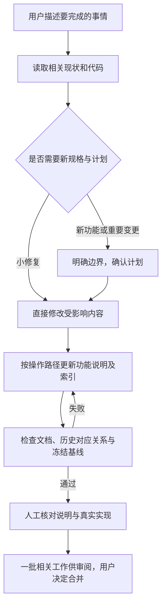

# 功能名：规划开发与维护文档

## 一句话说明

用户与AI明确要做的事，把计划落实为代码和可读的功能说明，再检查文档与实际实现是否一致。

## 用户操作路径

1. 用户描述要完成的事情；AI从[功能索引](README.md)找到相关操作路径，先读现状，再查对应代码。
2. 新功能或跨模块改造先明确用户、成功路径与不做范围，使用Spec Kit形成spec、plan、tasks；计划经用户确认后执行。小修复和文档修正可直接处理，不机械生成全套文档。
3. 开发时保存真实进度；功能说明按[模板](./_TEMPLATE.md)描述一条完整操作路径，包括成功、失败和必要的系统响应图，不按组件或样式拆篇。
4. 更新功能现状与索引；技术配置和完整命令链接到docs/system，历史原因从shaped-by找到specs。
5. 运行`npm run docs:check`与`npm run format:check`。遇到缺标签、索引不一致或冻结改写时，按错误定位修正，不通过就不称文档检查完成。
6. 实现和验收完成后同步spec/plan/tasks及索引为complete，再提交一批完整相关改动供审阅，用户决定合并。合并后规格正文冻结，下一次决定另写规格并关联旧规格；当前功能说明原地维护。
7. 功能及系统说明用code-sources对应源码文件，源码改动后复核文字、流程和验收再填写code-revision；只读候选摘要用npm run docs:check -- --revisions查看，正常检查会验证覆盖和摘要。
8. 合并或重命名功能说明时，使用`legacy-feature-ids`接续旧编号，保留历史规格原文；一个旧编号只能对应一个当前文档。

### 操作之后发生什么

当前文档可归并重写，旧规格正文仍保留。检查器通过当前文档的legacy-feature-ids找到旧功能编号对应的现状，不要求为历史编号保留一堆空壳文档。对应`scripts/docs-index.ts`、`scripts/docs-sources.ts`。

## 涉及的文件

- 协作入口与规则：`AGENTS.md`、`.specify/memory/constitution.md`。
- 当前功能：`docs/features/README.md`、`docs/features/_TEMPLATE.md`；历史变更入口：`specs/README.md`。
- 项目模板：`.specify/templates/overrides/spec-template.md`、`.specify/templates/overrides/plan-template.md`、`.specify/templates/overrides/tasks-template.md`。
- 工具：`.specify/feature.json`、`.specify/scripts/bash/check-prerequisites.sh`；上游技能在`.agents/skills/`，不按产品文档格式改写。
- 检查器：`scripts/docs-check.ts`、`scripts/docs-frontmatter.ts`、`scripts/docs-policy.ts`、`scripts/docs-index.ts`、`scripts/docs-sources.ts`。

## 验收标准

- [x] 当前索引按用户任务分组，每篇文档可独立找到操作、文件、验收、测试、依赖与限制。
- [x] 文档列出的文件与测试名称真实存在，流程图描述实际实现，未测项不勾选。
- [x] 合法文档与旧编号归并通过检查，重复归属、编号冲突及缺失现状文档报错。
- [x] 缺标签、错误索引、无效关联、已合并清单未完成时检查失败。
- [x] 冻结正文修改、删除和状态回退失败，合法的状态与后继关系更新可通过。
- [x] 源码变化未复核、缺少对应说明、失效现状链接被拒绝；全部任务完成但仍in-progress被拒绝。

最近有效验收：2026-09-06实际工作区npm run check通过，45项单元测试全绿。真实临时Git用例验证源码漂移、未覆盖新代码和冻结改写失败；complete稿在分支可修订，进入main后冻结；索引排序不改变规格字段；当前索引、链接、源码对应通过，001/002历史正文未改。此结果只覆盖文档及检查器，不表示网站重新发布。

## 对应的自动化测试

- `tests/unit/docs-policy.test.ts`：标签、索引、旧编号归并、来源和冻结规则。
- `tests/unit/docs-sources.test.ts`：源码覆盖、摘要变化和当前链接有效性。
- `tests/unit/docs-check.test.ts`：真实临时Git基线下的CLI失败/成功。
- `npm run docs:check`：检查当前仓库的文档目录、状态与关系。
- 模板栏目、说明质量、流程图与源码对应由人工审阅，不用关键词数量代替质量判断。

## 依赖的其他功能

无。此路径产出的代码与文档交给[检查与发布网站](project-commands.md)完成后续交付。

## 已知问题 / 待办

自动检查无法判断自然语言是否准确，也无法判断翻译或来源质量。只有生成技能文件不代表每条Spec Kit命令都已验证；没有自动合并或自动发布。
