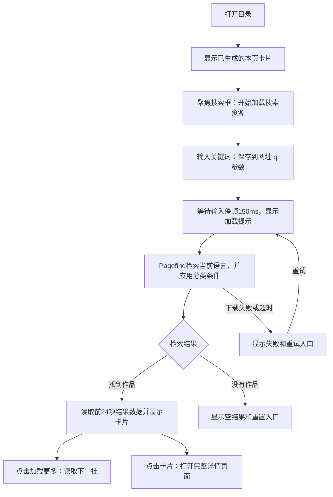

# 功能名：浏览与搜索作品

## 一句话说明

访客通过浏览、分类和关键词搜索找到感兴趣的作品，再打开详情阅读。

## 用户操作路径

1. 打开`/zh/`；访问`/`或`/explore/`会进入中文目录。
2. 浏览卡片，或点击“论文”“代码”等分类；内容超过一页时使用上一页、下一页，每页最多24件。
3. 输入关键词，搜索当前语言已发布作品的标题、简介与正文；选择了分类时只看该类结果，超过24项可点“加载更多”。
4. 点击卡片进入[作品详情](article-read.md)；返回Explore或刷新时保留分类与关键词。
5. 点English切换英文目录，只显示已发布英文内容；没有该语言内容时显示提示和原文入口。
6. 无结果时点“清空搜索与筛选”重新浏览；搜索框×只清关键词。加载失败时显示“重试”，不会把失败显示成零结果。
7. 打开不存在的地址时显示404，可返回中文目录；手机使用相同路径。

### 操作之后发生什么

普通浏览使用预生成HTML，不预先下载全文搜索索引；带q的网址会直接发起搜索。新输入或清空后，旧请求即使返回也不会覆盖当前结果。重试索引失败会重建搜索实例；搜索程序本身下载失败时会保留q并刷新页面。对应`src/scripts/explore.ts`和`src/scripts/search.ts`。

## 涉及的文件

- 页面：`src/pages/[locale]/index.astro`、`src/pages/[locale]/page/[page].astro`、`src/pages/[locale]/tags/[tagId]/[...page].astro`、`src/pages/404.astro`。
- 列表与外框：`src/components/Explore.astro`、`src/components/Preview.astro`、`src/layouts/Layout.astro`。
- 搜索与语言：`src/scripts/explore.ts`、`src/scripts/search.ts`、`src/lib/i18n/routes.ts`、`src/lib/i18n/messages.ts`。
- 数据：`src/data/works.ts`、`src/lib/content/views.ts`、`src/data/taxonomy.json`；由[内容维护](content-maintenance.md)提供作品。
- 手机样式：`src/styles/cards.css`、`src/styles/responsive.css`；检索限制与分页参数见[规则](../technical/CONSTANTS.md)。

## 验收标准

- [ ] 首页只显示当前语言的已发布作品，卡片能进入正确详情。
- [ ] 分类与关键词同时生效；刷新、进入详情再返回后条件保留。
- [ ] 能通过正文中的词找到作品，不只匹配卡片上的文字。
- [ ] 清空关键词保留分类；空结果中的重置恢复全部目录。
- [ ] 下载失败有重试入口，清空搜索后旧请求不覆盖当前列表。
- [ ] 多页目录可翻页，搜索结果可加载更多；无JavaScript仍能浏览与翻页。
- [ ] 320px宽度无整页横向溢出；不存在地址返回404并有回首页入口。
- [ ] 普通浏览不下载搜索索引，开始搜索后才加载。

本次仅重写文档，以上未重新验收。历史证据：2026-09-05 Playwright桌面/手机模拟及5000×2隔离目录验收通过；2026-09-06 ego-browser实际检查中文目录、搜索和进入详情。原始记录在`resources/evidence/001-multilingual-explore/`，不是本次全项通过。

## 对应的自动化测试

`tests/explore.spec.ts`：

- `local filtering, empty state, and URL survive refresh`
- `cards navigate directly to a complete article; browser back restores filters`
- `no horizontal overflow, no embeds, two-line card descriptions`
- `lazy full-text search and detail back link preserve the query`
- `failed search resources can retry and clearing cancels stale results`
- `failed result fragments recover after explicit retry`
- `failed lazy search client can recover without losing the query`
- `static output stays small and content routes exist`

大目录分页和结果分批由`scripts/measure-explore.ts`单独验证，不属于每次普通E2E；单位规则见`tests/unit/i18n.test.ts`。

## 依赖的其他功能

- [维护作品内容](content-maintenance.md)：提供已发布作品和标签。
- [阅读作品详情](article-read.md)：承接卡片点击后的阅读路径。

## 已知问题 / 待办

- 搜索需要JavaScript；中文搜索不做词干还原。
- 当前英文只有一件已发布样例，无法展示与中文等量的内容。
- 真机Safari、完整键盘路径与读屏尚无完整验收；模拟手机通过不代表所有设备通过。
- 大目录本地性能通过不代表当前免费托管容量足够，容量限制见[检查与发布](project-commands.md)。
