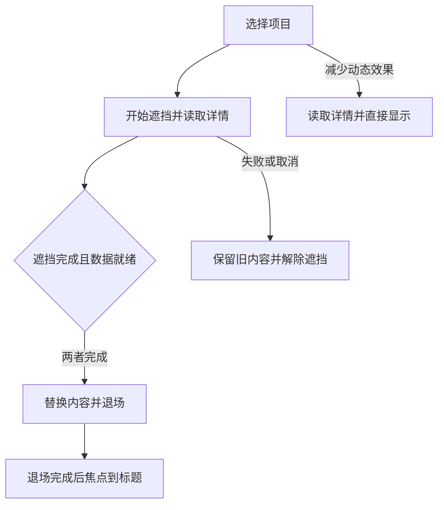

# 功能名：学习交互作品并带入自己的项目

## 一句话说明

从Explore的Great UI合集进入48件独立学习页面，观看原作交互、理解设计、选择改造目标，并把同一份说明生成给Agent的任务；需要完整流程时先比较组合，再体验三条已接好的示例。

## 用户操作路径

1. 在Explore打开“Great UI交互学习”合集，选择一件作品，进入`/zh/works/great-ui-<slug>/`。普通目录只列一次合集；全文搜索可以直接找到每件作品的标题、说明、改造目标和术语。
2. 打开页面即加载当前MP4并静音循环播放；不会预载其他作品视频。48件都使用随本站提供的短片与封面，离屏、进入后台或开启减少动态效果时暂停。可以手动播放、暂停、拖动进度或放大；放大时其余页面不可操作，Escape关闭后恢复焦点。失败时保留原作入口。
3. “拆解设计”说明原作顺序、形成原理和接入限制；点击术语看共享词库的中文解释及本例应用，可打开完整词条查看变体、提示词和出处。点击“相似作品”或“相同原理”整行入口切换案例。作品列表还可搜索中文、英文或行为词并按分类筛选。
4. “改造设计”选择目标，核对Agent应改的行为与检查结果，再点“生成修改任务”或“用这个效果”。填写接入位置和要求，查看文本或JSON后复制；学习页与素材使用当前站点的绝对地址，PR预览复制后也能访问对应预览素材；复制失败时可手动选择全文。原作记录与目标要求分开，例如多项比较按同时展开验收，单项规则只作原作对照。
5. “串联设计”选择作品集、产品介绍或任务工具，再选框架、输入方式、外部数据、使用频率和动态偏好。默认保留当前作品；不适合时解释原因，不硬凑方案。允许必要改造时可用普通文字、表单或链接补齐。
6. 候选最多三份，逐步说明作品、必要条件与适配；复制整条任务会带上相同输入、固定源码、每个环节、交接要求和验证范围。候选仍是建议，目标项目需实际接入验证。
7. 串联栏可进入三个可操作示例。作品集读取本站JSON后切换详情、展开问答和查看联系信息；产品页可比较方案、同时展开答案并确认选择；工具页根据实际输入与读取结果检查资料。选择不创建订单，检查不执行外部部署。示例中的“复制这条示例的任务”使用同一固定路径。示例脚本加载失败时保留返回说明和重新加载页面入口；返回保留草稿，整页重新加载会清除草稿。
8. 返回学习页或使用浏览器前进后退，可以恢复当前页面会话中每件作品的面板、输入和组合条件；刷新清除内存草稿。示例网址中的journey与project只恢复对应入口，不保存用户填写的内容。
9. 点击右上角编辑图标，编辑当前语言的Markdown并提出PR，完整贡献流程见[GitHub内容贡献](../system/content-contributions.md)。本站不保存编辑；正式构建指向main，PR阶段预览指向相应分支。学习详情不显示网站header或语言栏；左上角返回图标回到合集，语言入口保留在Explore，未发布的英文地址不生成。
10. 无JavaScript仍可读初始说明、原作链接，并展开“文字版说明”阅读全部正文、目标、检查与术语；生成任务、筛选和组合需要JavaScript。正文下方没有另一份手工维护的说明。
11. 点“和Agent聊这篇”时，[本地助手](local-assistant.md)附上当前作品的公开标题和本站网址，保留现有草稿；用户发送前不会提交消息。

### 示例中的页面切换

顺序对应journey/Portfolio.tsx与Transition.tsx。运行中开启减少动态效果会解除遮挡并继续读取；该次读取期间再关闭偏好仍直接换页，下次导航才恢复动画。站内页面之间由Astro负责导航，同一学习页内的示例历史由学习组件恢复，避免两套处理同时切页。原作的计时转场没有这套加载协调，示例改造不代表所有上游变体已验证。

## 维护同一份材料

每件作品只维护`src/content/works/great-ui-<slug>/zh.md`。正文必须依次包含`## 拆解设计`、`## 改造设计`和`## 串联设计`；第一节还须保留“适合用在哪里”“什么时候不用”“试一次，就会更懂”三级标题。正文支持段落、强调、列表、链接、代码和`[[术语ID|显示词]]`；HTML、任意组件和未登记术语会被拒绝。

文件头learning保存分类、改造目标、判断方法、可调整项、检查与术语引用。work.json的learning保存固定源码、合集身份、媒体路径和组合能力。改写说明或目标后，页面与文本/JSON任务从同一来源生成；不再维护平行的MJS文案表。写法及字段见[内容结构](../system/content-model.md#交互学习材料)，完整示例是[折叠问答](../../src/content/works/great-ui-accordion/zh.md)。

通用术语在[共享词库](../../src/content/glossary/README.md)按工具、触发、动效及UX规则维护。作品glossary仅写term和本例context、parameter、judgment，正文局部ID保持不变。来源文章完整保存，词条标明摘录、概述整理或案例整理；别名合并到同一规范ID。修改词条后，引用作品的页面与任务同步解释及出处，相关翻译和组合内容摘要改变。收录步骤见[维护术语](content-maintenance.md#收录与引用uiux术语)。

录屏和海报位于public/great-ui/media，录制来源与文件摘要保存在data/local-recordings.json。新增或重录时按[录制与维护交互演示](recording-previews.md)完成观察、捕获、转码、登记和真实播放检查。

## 涉及的文件

- 页面与内容：src/components/GreatUiDetail.astro、src/features/great-ui/LearningPage.jsx、markdown-content.ts、compile-prose.ts和site-content.ts。
- 浏览与播放器：CaseView.jsx、CaseNavigation.jsx、Recording.jsx、Terms.jsx；样式限制在great-ui区域。
- 来源依据：data/upstream-catalog.json、observations.json、source-review.json和local-recordings.json；relations.mjs维护经源码核对的原理关系。
- 任务与组合：task.mjs、PromptDialog.jsx、composition/；同一结构生成文本和JSON。
- 示例：JourneyLoader.jsx处理脚本加载与失败，journey/实现三条路径，sources.json和LICENSE.txt说明来源及改造；本站/great-ui/content与/great-ui/journeys生成对应JSON。
- 辅助本地入口：scripts/great-ui.ts从同一Markdown生成.scratch/great-ui-dist；运行great-ui:build后用great-ui:preview打开127.0.0.1:4325，先确认服务归属与端口。

## 验收标准

- [x] 48件固定源码均有实际原作操作记录；2026-09-14原三例与其余45件的内置浏览器证据仍有效，未覆盖变体明确保留。
- [x] 48份Markdown材料、来源映射、任务一致性、拒绝坏结构与素材摘要通过2026-09-14单元检查。
- [x] 2026-09-14共享词库3项契约测试及全体170项单元通过；静态产物逐件核对48页与任务JSON一致，60处案例说明/参数/判断保留，原文章节完整且字节一致，网站与独立入口预算通过。该增量按用户要求未重复浏览器或独立审查。
- [x] 2026-09-14站内桌面Chromium逐件验证48段本站MP4解码、自动播放、无外部媒体请求和横向溢出；同轮通过搜索、无JS正文和跨作品草稿恢复。
- [x] 2026-09-14站内三浏览器的48段播放、三条示例、任务与原生助手作品引用通过；脚本失败恢复与当前站点素材链接另通过6项专项，预算及产物预检通过。header与图标按用户要求只做静态/类型检查，没有重跑浏览器。
- [ ] 整站最终完整验收回执尚未生成。此前整站298项通过、5项按设备跳过，3项旧模板静态断言失败；已补学习模板分支，用户要求不再重复整站回归。
- [x] 2026-09-14独立工作台66项三浏览器回归、20个评估样本与预算通过；后续脚本恢复修复另通过3项三浏览器专项。新增回执守卫单元通过，完整新版本回执仍待统一验收。

既有2026-09-14组合引擎的11项单元规则、20个结构化需求与原作审查记录保留；迁移后完整页面验收以上述范围为准。原始证据在resources/evidence/018-great-ui-scale/integration，模拟手机宽度不等于真机验收。

## 对应的自动化测试

- tests/unit/learning-content.test.ts：Markdown到页面与任务的单一来源、结构/术语/素材拒绝、合集与语言边界。
- tests/unit/glossary.test.ts：共享词条编辑同步两件作品与两种任务、相关修订失效、重复与别名冲突、缺失引用和禁止本地重复定义。
- tests/unit/great-ui-content.test.ts：48件来源、说明、关系、视频摘要与目标任务。
- tests/unit/great-ui-composition.test.ts：能力、条件、全局资源冲突、缺口、有界搜索及版本失效。
- tests/fixtures/great-ui/journey.ts：同一组正常、慢请求、失败、取消、历史及动态偏好测试；由站内great-ui-site.spec.ts和独立journey.spec.ts复用。
- tests/great-ui-site.spec.ts另覆盖搜索、48段本站播放、无JS、草稿、放大焦点与Paseo作品引用，包含在verify中。
- great-ui:verify检查独立入口；great-ui:evaluate保存结构化样本和合成负载，great-ui:budget检查入口、详情与媒体。正式站另按verify与budget验收。

## 依赖的其他功能

复用[内容维护](content-maintenance.md)、[浏览与搜索](explore-browse.md)、[本地助手](local-assistant.md)和[检查与发布](project-commands.md)。普通文章沿用原有阅读模板。

## 已知问题 / 待办

- 原作线上页面不能证明部署SHA；源码结论固定于eda1b85ed81ab45d0f0cbc27dc0206560d11c801，浏览器记录说明访问时的操作范围。README与LICENSE描述不一致，许可说明依据实际自定义LICENSE；未打包分发原作组件库。
- 固定示例只有匹配当前版本的完整验收回执才显示已验证。完整test:e2e写入site-verification.json，独立great-ui:test写入standalone-verification.json；两者不互相代替，筛选重跑不签发回执。main可信复用完全相同文件树的PR回归时，重建site回执并明确引用原验收run/attempt，不声称本次重新测试。源码、Markdown、共享词库、能力、规则、条件、适配器或测试变化使旧记录失效。
- 示例通过不等于已接入用户项目。自由文本推荐质量、全部原作变体和真机操作未被结构化样本代替。
