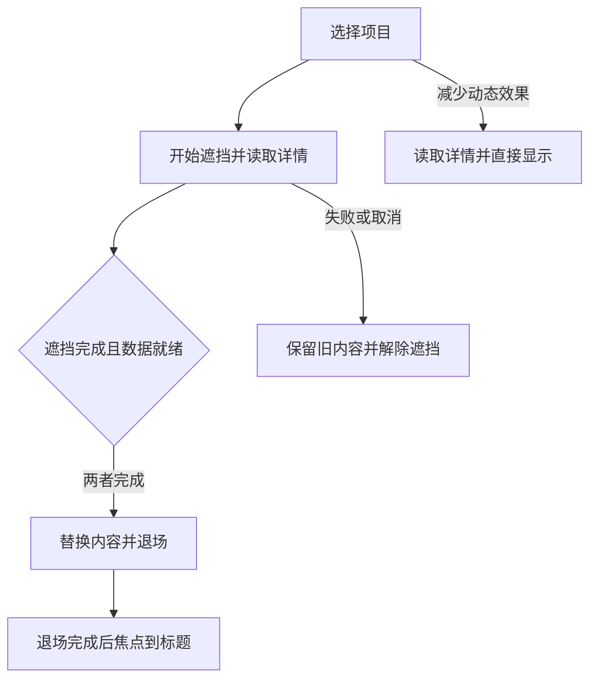

# 功能名：学习交互作品并带入自己的项目

## 一句话说明

在本地工作台浏览48件Great UI作品，理解行为与限制，填写改造意图，复制给Agent执行；需要完整流程时按项目条件选择组合，并体验固定的三条本地示例。

## 用户操作路径

1. 在仓库运行`npm run great-ui:build`，再运行`npm run great-ui:preview`，打开`http://127.0.0.1:4325/`。维护者先确认端口是否已有适合复用的服务。这个入口不在正式Explore站内，发布保持暂停。
2. 在作品列表搜索中文、英文或行为词，按分类缩小范围，点击切换作品。48件来自固定目录，类型、用途、行为分别显示；没有结果时可清空搜索。
3. 打开作品即加载当前MP4并静音循环播放；不预载其他作品，离开可视区域、隐藏页面或开启减少动态效果时暂停。14件使用本地录屏，32件读取作者MP4，两件显示作者静态预览图。本地素材包含原三例，以及在原作页面实际操作后新录制的11段；来源、操作和文件摘要记在local-recordings.json。预览紧接播放控制和作品切换栏，无启动卡片或额外提示行。录屏提供播放、暂停、进度和放大；媒体失败时可打开原作。
4. “拆解设计”说明原作顺序、形成原理和接入限制；点击术语了解中文解释。底部按“相似作品”和“相同原理”列出整行入口，点击作品名称所在行即可切换；共同原理以简短文字标在同一行。
5. “改造设计”选择目标，核对Agent应改的位置与可观察结果。点击“生成修改任务”或“用这个效果”，填写接入位置和要求，查看文本或JSON后复制。任务把原作参考与目标要求分开：例如多项比较按同时展开验收，原作单项规则只作对照。复制失败时保留全文以便手动选择。
6. “串联设计”先选作品集、产品介绍或任务工具路径，再选择框架、主要输入方式、外部数据、频率和减少动态效果。默认保留当前作品；不适合该路径时解释原因，不硬凑方案。允许必要改造时可以加入普通文本、表单或链接等基础实现。
7. 候选最多三份，逐步说明所选作品、必要条件和适配。生成整条任务时保留相同用户输入、固定源码版本、每个环节、交接要求与验证范围。候选是建议，用户项目仍需实际接入验证。
8. 串联栏下方可打开实际接好的三条示例：作品集可进入真实本地JSON详情、展开问答和查看联系入口；产品页可比较两种方案、展开多项问答并确认选择；任务工具可填写资料并运行实际本地检查。产品选择不创建订单，工具检查不执行外部部署。示例下方“复制这条示例的任务”使用同一固定路径、来源与系统动态偏好；显示相符验收记录时才标为该固定示例已验证。
9. 返回工作台后，本次页面会话中每件作品的标签页、改造输入和组合条件保留；浏览器前进后退可恢复作品或示例入口。刷新会清除内存草稿。
10. 目录、详情或组合材料失败时有重试入口；不存在的作品可返回首件。切换作品时取消上一份详情请求，避免慢响应替换当前选择。关闭JavaScript或脚本未能启动时，静态说明和原作链接仍可使用。

### 示例中的页面切换

顺序对应journey/Portfolio.tsx与Transition.tsx。运行中开启减少动态效果会解除遮挡并继续当前读取，退出时也直接交接；该次读取期间再关闭偏好仍保持直接换页，下次导航才恢复动画。任务中的条件随系统偏好更新。原作计时转场没有这套真实加载协调；本地示例的改造不能当作其他候选或所有上游变体已通过。

## 涉及的文件

- 入口与浏览：src/features/great-ui/App.jsx、CaseView.jsx、CaseNavigation.jsx、Recording.jsx。
- 材料：src/features/great-ui/data/下的upstream-catalog.json、curation.json、observations.json、source-review.json和local-recordings.json；content-build.mjs导出目录、独立详情和任务文本，relations.mjs维护经源码核对的原理关系。
- 任务：src/features/great-ui/task.mjs与PromptDialog.jsx；同一结构产生文本和JSON。
- 组合：src/features/great-ui/composition/下的model.ts、templates.ts、rules.ts、planner.ts、validate.ts和CompositionPanel.tsx。
- 示例：src/features/great-ui/journey/；sources.json和LICENSE.txt说明来源及改造。
- 本地构建：scripts/great-ui.ts；输出在.scratch/great-ui-dist，未进入生产Astro路由。

需要新增或重录演示时，按[录制与维护交互演示](recording-previews.md)完成原作观察、捕获、转码、来源登记和真实播放检查。

## 验收标准

- [x] 48件独立中文详情、固定源码与预览入口可生成；2026-09-14以great-ui:build校验目录、详情与能力并完成Vite构建。
- [x] 组合规则拒绝能力缺口与全局冲突，未知条件明确保留，版本变化使记录失效；2026-09-14运行tests/unit/great-ui-composition.test.ts共11项通过。
- [x] 三条示例的正常路径、慢请求、失败、取消、快速历史切换与动态偏好双向变化通过回归；2026-09-14以great-ui:verify运行16项单元和22项浏览器用例，后者在桌面Chromium、手机Chromium、手机WebKit通过，共66项。
- [x] 48件原作均取得实际操作观察：原三例补录与其余45件的2026-09-14内置浏览器记录；未覆盖变体明确保留，证据文件摘要随记录保存。
- [x] 2026-09-14用实际工作台与真实媒体地址检查48件：46个MP4均完成解码并自动播放，2张图片解码成功。没有请求替身或失败重试，结果保存于live-media-playback.json；另在内置浏览器确认本地字符画录屏自动播放。
- [x] 2026-09-14专用三浏览器覆盖搜索、全量导航、草稿、复制失败和历史恢复；内置浏览器另完成桌面和390px宽度的三条路径、网络失败后继续操作及推荐区布局核对。模拟宽度不等于真实手机验收。
- [x] 2026-09-14独立预算通过：入口JS约77KiB gzip，全部本地媒体约1.95MiB、单文件最大约325KiB；限额分别为100KiB、2MiB和400KiB，正式站预算未改变。

## 对应的自动化测试

- tests/unit/great-ui-composition.test.ts：能力、条件、整份资源冲突、缺口、有界搜索、指定作品及版本失效。
- tests/great-ui/journey.spec.ts：延迟与失败数据、前进后退、窄屏减少动态效果、产品选择与真实本地工具检查。
- tests/unit/great-ui-content.test.ts与tests/great-ui/learning.spec.ts：48件结构、来源、术语与改造、搜索、草稿、失败、任务文本/JSON与条件说明。
- great-ui:evaluate按tests/great-ui/evaluation.json检查20个目标及合成负载；great-ui:budget独立检查压缩入口、目录、详情及本地媒体，原始证据位于resources/evidence/018-great-ui-scale。
- 单独浏览器入口为`npm run great-ui:test`，完整本地检查为`npm run great-ui:verify`，使用playwright.great-ui.config.ts创建独立测试服务。新增覆盖和最终运行证据以实际结果更新本页。

## 依赖的其他功能

本地工作台独立于正式站的内容列表、数据库和本地助手连接；仓库检查、保存与审查沿用[检查与发布网站](project-commands.md)。

## 已知问题 / 待办

- 作者线上页面不能证明部署SHA；实现结论固定于eda1b85ed81ab45d0f0cbc27dc0206560d11c801，浏览器记录只说明访问时的操作范围。source-review记录实现和预览文件摘要；原始证据放resources/evidence/018-great-ui-scale。
- README与源码页脚宣称MIT，但仓库LICENSE为自定义许可；材料按实际LICENSE说明使用与再分发限制。来源素材与分发范围未获新的发布确认。
- 32个作者MP4仍依赖外部服务，最近一次真实播放检查通过不保证以后持续可用。11个作者地址曾返回429，当前使用独立录制的本地原作交互，不是受限视频的复制或代理；原作线上页面不能证明部署SHA。
- 自动组合仍是建议。三条固定示例共享composition/demos.ts路径记录，DemoTask生成同一任务；great-ui:test只有不带筛选参数且全部浏览器通过、源码在测试前后未变时才保存六份动态偏好记录。重建时，来源、内容、能力、规则、项目条件、适配器或测试变化使旧记录失效；原始回执在resources/evidence/018-great-ui-scale/journey-verification.json。
- 示例通过不等于接入用户项目；全部变体、真机与用户项目仍需各自验证。
- 2026-09-14的20个结构化需求样本（12个调整、8个保留检查）通过；未指定作品的正向路径覆盖8/8，已知硬冲突漏报和条件披露遗漏为0。这不是自由文本推荐质量或用户研究；开发样本2曾将触摸误当成必然需要悬停适配，已修正为比较基础实现，未据此调整引擎。
- 同轮1,000/10,000条合成数据的搜索中位耗时约0.69/3.37毫秒，7次最大约0.85/3.67毫秒；结果只说明当前机器的计算成本。运行great-ui:evaluate会保存当前实测JSON。
