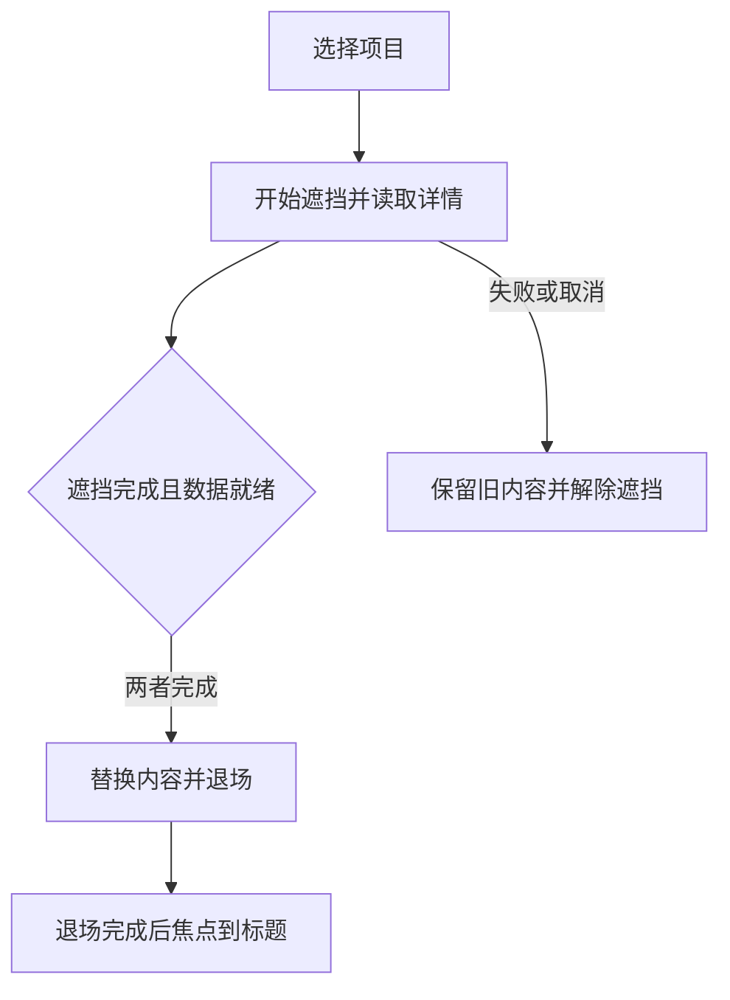

# 功能名：学习交互作品并带入自己的项目

## 一句话说明

在本地工作台浏览48件Great UI作品，理解行为与限制，填写改造意图，复制给Agent执行；需要完整流程时按项目条件选择组合，并体验固定的三条本地示例。

## 用户操作路径

1. 在仓库运行`npm run great-ui:build`，再运行`npm run great-ui:preview`，打开`http://127.0.0.1:4325/`。维护者先确认端口是否已有适合复用的服务。这个入口不在正式Explore站内，发布保持暂停。
2. 在作品列表搜索中文、英文或行为词，按分类缩小范围，点击切换作品。48件来自固定目录，类型、用途、行为分别显示；没有结果时可清空搜索。
3. 原三件样板使用本地作者演示素材，其余点击“播放作者演示”后才请求作者媒体；也可打开原作实际操作。静态预览图单独展示；录屏提供播放、暂停、进度和放大，保持静音。媒体失败时仍可打开原作。
4. “拆解设计”说明原作顺序、形成原理和接入限制；点击术语了解中文解释，再比较同类作品或共同原理的其他应用。
5. “改造设计”选择目标，核对Agent应改的位置与可观察结果。点击“生成修改任务”或“用这个效果”，填写接入位置和要求，查看文本或JSON后复制。复制失败时保留全文以便手动选择。
6. “串联设计”先选作品集、产品介绍或任务工具路径，再选择框架、主要输入方式、外部数据、频率和减少动态效果。默认保留当前作品；不适合该路径时解释原因，不硬凑方案。允许必要改造时可以加入普通文本、表单或链接等基础实现。
7. 候选最多三份，逐步说明所选作品、必要条件和适配。生成整条任务时保留相同用户输入、固定源码版本、每个环节、交接要求与验证范围。候选是建议，用户项目仍需实际接入验证。
8. 串联栏下方可打开实际接好的三条示例：作品集可进入真实本地JSON详情、展开问答和查看联系入口；产品页可比较两种方案、展开多项问答并确认选择；任务工具可填写资料并运行实际本地检查。产品选择不创建订单，工具检查不执行外部部署。
9. 返回工作台后，本次页面会话中每件作品的标签页、改造输入和组合条件保留；浏览器前进后退可恢复作品或示例入口。刷新会清除内存草稿。
10. 目录、详情或组合材料失败时有重试入口；不存在的作品可返回首件。切换作品时取消上一份详情请求，避免慢响应替换当前选择。

### 示例中的页面切换

顺序对应journey/Portfolio.tsx与Transition.tsx。原作计时转场没有这套真实加载协调；本地示例的改造不能当作其他候选或所有上游变体已通过。

## 涉及的文件

- 入口与浏览：src/features/great-ui/App.jsx、CaseView.jsx、CaseNavigation.jsx、Recording.jsx。
- 材料：src/features/great-ui/data/upstream-catalog.json、curation.json、observations.json、source-review.json；content-build.mjs导出目录、独立详情和任务文本，relations.mjs维护经源码核对的原理关系。
- 任务：src/features/great-ui/task.mjs与PromptDialog.jsx；同一结构产生文本和JSON。
- 组合：src/features/great-ui/composition/下的model.ts、templates.ts、rules.ts、planner.ts、validate.ts和CompositionPanel.tsx。
- 示例：src/features/great-ui/journey/；sources.json和LICENSE.txt说明来源及改造。
- 本地构建：scripts/great-ui.ts；输出在.scratch/great-ui-dist，未进入生产Astro路由。

## 验收标准

- [x] 48件独立中文详情、固定源码与预览入口可生成；2026-09-14以great-ui:build校验目录、详情与能力并完成Vite构建。
- [x] 组合规则拒绝能力缺口与全局冲突，未知条件明确保留，版本变化使记录失效；2026-09-14运行tests/unit/great-ui-composition.test.ts共10项通过。
- [x] 三条示例的正常路径、慢请求、失败与窄屏减少动态效果有桌面Chromium回归；2026-09-14运行tests/great-ui/journey.spec.ts的5项检查通过。取消和快速连续导航尚需补测。
- [ ] 48件原作均取得本轮实际操作观察，未覆盖变体明确记录。
- [ ] 搜索、全量导航、草稿、复制失败、历史恢复与三条路径完成最终桌面和手机核对。
- [ ] 全部必需检查和独立PR审查完成。

## 对应的自动化测试

- tests/unit/great-ui-composition.test.ts：能力、条件、整份资源冲突、缺口、有界搜索、指定作品及版本失效。
- tests/great-ui/journey.spec.ts：延迟与失败数据、前进后退、窄屏减少动态效果、产品选择与真实本地工具检查。
- tests/unit/great-ui-content.test.ts与tests/great-ui/learning.spec.ts：48件结构、来源、术语与改造、搜索、草稿、失败、任务文本/JSON与条件说明。
- great-ui:evaluate按tests/great-ui/evaluation.json检查20个目标及合成负载；great-ui:budget独立检查压缩入口、目录、详情及本地媒体，原始证据位于resources/evidence/018-great-ui-scale。
- 专用入口为`npm run great-ui:test`，使用playwright.great-ui.config.ts创建独立测试服务。新增覆盖和最终运行证据以实际结果更新本页。

## 依赖的其他功能

本地工作台独立于正式站的内容列表、数据库和本地助手连接；仓库检查、保存与审查沿用[检查与发布网站](project-commands.md)。

## 已知问题 / 待办

- 作者线上页面不能证明部署SHA；实现结论固定于eda1b85ed81ab45d0f0cbc27dc0206560d11c801，浏览器记录只说明访问时的操作范围。source-review记录实现和预览文件摘要；原始证据放resources/evidence/018-great-ui-scale。
- README与源码页脚宣称MIT，但仓库LICENSE为自定义许可；材料按实际LICENSE说明使用与再分发限制。来源素材与分发范围未获新的发布确认。
- 作者媒体按原地址播放，未保证所有地址持续可用；原作观察不代表媒体地址、其他变体、真实手机或用户项目组合都已验证。
- 组合候选尚无与其对应的完整运行证据；三条固定示例单独展示。全量浏览器覆盖与最终验收仍在完成中。
- 2026-09-14的20个结构化需求样本（12个调整、8个保留检查）通过；未指定作品的正向路径覆盖8/8，已知硬冲突漏报和条件披露遗漏为0。这不是自由文本推荐质量或用户研究；开发样本2曾将触摸误当成必然需要悬停适配，已修正为比较基础实现，未据此调整引擎。
- 同轮1,000/10,000条合成数据的搜索中位耗时约0.69/3.35毫秒，7次最大约0.89/5.13毫秒；结果只说明当前机器的计算成本。运行great-ui:evaluate会保存当前实测JSON。
