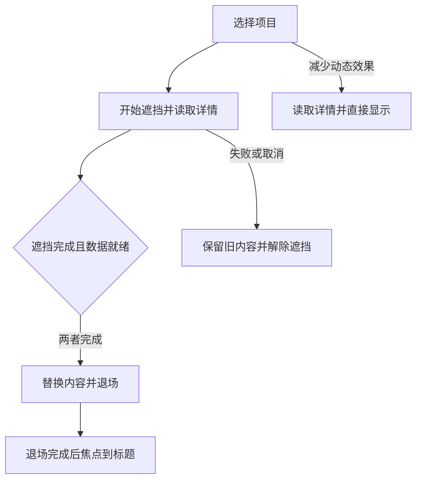

# 功能名：学习交互作品并带入自己的项目

## 一句话说明

从Explore的《Vibe Coding 网页动效与交互》跟着活动报名卡学习状态、输入与运动，沿八站路线或十类索引观看原作，再生成给Agent的改造任务。合集包含51件独立页面，19件主讲围绕真实内容、设计判断与可观察的练习组织；需要完整流程时可比较组合及三个可操作示例。

## 用户操作路径

1. 在Explore点合集标题，先按正文用虚构活动报名卡完成静态操作、四状态、展开/选择、节奏比较、Agent改造和五项检查；需要继续练习时，按“按钮→图片卡→折叠问答→浮动导航→分步状态清单→滚动文字揭示→错峰页面转场→扩散主题切换”入门，或从十类目录选学习目标。首屏左右箭头切换51件轻量封面，下方名称进入当前作品；封面与学习路线分别排序，同一标签页保留所选封面。普通目录只列一次合集，全文搜索仍覆盖全部作品、目标和术语。
2. 进入`/zh/works/<id>/`后，只加载当前作品适合窗口宽度的一份高清MP4并静音循环播放，不预载其他作品。51件都有轻量封面和完整素材，其中33件另有窄屏录屏；其余复用完整桌面构图。离屏和后台暂停，减少动态或省流量时由用户手动播放。可以暂停、拖动进度或放大；失败时保留原作入口。
3. “拆解设计”说明原作顺序、形成原理和接入限制；点击术语看共享词库的中文解释及本例应用，可打开完整词条查看变体、提示词和出处。点击“相似作品”或“相同原理”整行入口切换案例；这些入口与组合步骤都从当前目录查找稳定作品地址，兼容不同来源的ID。作品列表还可搜索中文、英文或行为词并按分类筛选。
4. “改造设计”选择目标，用自己的页面、内容和受众说明需求，由Agent实施，自己观察结果并作出设计判断；无需亲自阅读或改写源码。再点“生成修改任务”或“用这个效果”，填写接入位置和要求，查看文本或JSON后复制；素材使用当前站点绝对地址，复制失败时可手动选择全文。原作相关检查要求与改造要求分开，例如多项比较按同时展开检查，单项规则只作原作对照；要求不表示改造已经实现。
5. “串联设计”选择作品集、产品介绍或任务工具，再选框架、输入方式、外部数据、使用频率和动态偏好。默认保留当前作品；不适合时解释原因，不硬凑方案。允许必要改造时可用普通文字、表单或链接补齐。
6. 候选最多三份，逐步说明作品、必要条件与适配；复制整条任务会带上相同输入、固定源码、每个环节、交接要求和验证范围。候选仍是建议，目标项目需实际接入验证。
7. 串联栏可进入三个可操作示例。作品集读取本站JSON后切换详情、展开问答和查看联系信息；产品页可比较方案、同时展开答案并确认选择；工具页根据实际输入与读取结果检查资料。选择不创建订单，检查不执行外部部署。示例中的“复制这条示例的任务”使用同一固定路径。示例脚本加载失败时保留返回说明和重新加载页面入口；返回保留草稿，整页重新加载会清除草稿。
8. 返回学习页或使用浏览器前进后退，可以恢复当前页面会话中每件作品的面板、输入和组合条件；刷新清除内存草稿。示例网址中的journey与project只恢复对应入口，不保存用户填写的内容。
9. 点击右上角编辑图标，编辑当前语言的Markdown并提出PR，完整贡献流程见[GitHub内容贡献](../system/content-contributions.md)。本站不保存编辑；正式构建指向main，PR阶段预览指向相应分支。学习详情不显示网站header或语言栏；左上角返回图标回到合集，语言入口保留在Explore，未发布的英文地址不生成。
10. 无JavaScript仍可读初始说明、原作链接，并展开“文字版说明”阅读全部正文、目标、检查与术语；生成任务、筛选和组合需要JavaScript。正文下方没有另一份手工维护的说明。
11. 点“和Agent聊这篇”时，[本地助手](local-assistant.md)附上当前作品的公开标题和本站网址，保留现有草稿；用户发送前不会提交消息。

### 选择浏览范围与顺序

1. 点视频下方的四宫格入口“全部分类”，打开“浏览作品”弹窗。可以搜索名称、用途或行为，也可以选择“页面转场”等分类。选中一件作品后，入口更新为该分类，下一件也只在这个范围内；直接关闭弹窗不改变范围，搜索词只筛选列表。范围内数量只在右侧“01/10”一类进度中显示，分类旁不重复计数。
2. 分类文字右侧的小底色按钮表示当前模式：细线列表表示顺序，交叉箭头表示随机；悬停可读当前模式和切换提示。首次默认为全部分类加顺序，前八件组成入门路线；也可主动切换随机，切换保持当前作品和已看记录。选定分类后不会自动跳出，想跨分类探索时再次打开弹窗，选择全部分类并进入一件作品。
3. 随机每轮不会自动重复已看作品，全部分类时优先避免连续同类；只有同类剩余时照常继续。上一件返回实际看过的作品，退回后再点下一件沿用原顺序；手动选择作品可以重访。随机计数表示该作品在本轮首次浏览的位置，顺序计数表示它在范围内的目录位置。
4. 随机看完或顺序到末尾时显示结束提示，点回转箭头主动开始新一轮；仅一件的分类停留当前作品。随机新一轮首件避开刚看的作品。开启随机会重排尚未浏览的作品；关闭后从当前作品在目录中的下一件继续，可能再次遇到已看作品。切换开关不清空已看集合，换范围或重开一轮才开始新的记录。
5. 范围和模式会在同一浏览器的下次访问保留，已有有效随机选择不被改成顺序；同一页刷新保留本轮记录，浏览器前进后退恢复各页当时的范围与顺序。当前作品的“分类”标签显示教学分类。已删除的旧分类或范围外直达回到全部分类；存储损坏会重新开始，浏览器禁止存储时仅在当前访问中保留。

导航历史最多保留最近1,000次操作。浏览记录与作品填写草稿分开：刷新保留前者，但不保留草稿；详细存储位置见[配置说明](../system/configuration.md#great-ui浏览偏好与记录)。

低高度桌面视口（高度不超过900px）不固定左侧录屏栏，便于纵向滚动到长录屏下方的任务按钮。

### 放大与查看细节

点击“放大录屏”进入占满页面视口的查看器，画面按自身比例适配；用加减按钮或双指手势在100%–300%间缩放，拖动或用方向键移动，点击百分比重置。手机横向素材默认放大到150%，便于看清文字；重置为100%可看到完整构图。原作手机布局本身裁切的固定卡片使用完整桌面录屏，不把原作裁切当成本站响应式效果。

放大保留播放位置和暂停状态，窗口跨过800px时选用对应素材并按进度比例继续；手动播放不因旋转或减少动态偏好重新暂停。查看器打开时锁定背景，Tab留在内部；按Escape或“缩小录屏”退出后恢复焦点。这里使用页面内全屏，浏览器地址栏仍可能存在；不要求原生Fullscreen API。仅在调整进度（包括回到开头）或旋转恢复位置时，为当前素材建立最多2MiB的可跳转副本，避免浏览器与静态服务的分段读取差异；连续拖动复用副本并以最后一次选择为准，切换素材或离开页面会取消旧请求并释放副本。

### 示例中的页面切换

顺序对应journey/Portfolio.tsx与Transition.tsx。运行中开启减少动态效果会解除遮挡并继续读取；该次读取期间再关闭偏好仍直接换页，下次导航才恢复动画。站内页面之间由Astro负责导航，同一学习页内的示例历史由学习组件恢复，避免两套处理同时切页。原作的计时转场没有这套加载协调，示例改造不代表所有上游变体已验证。

## 维护同一份材料

每件作品只维护`src/content/works/<id>/zh.md`。正文必须依次包含`## 拆解设计`、`## 改造设计`和`## 串联设计`；第一节还须保留“适合用在哪里”“什么时候不用”“试一次，就会更懂”三级标题。正文支持段落、强调、列表、链接、代码和`[[术语ID|显示词]]`；HTML、任意组件和未登记术语会被拒绝。

文件头learning保存教学分类、改造目标、判断方法、可调整项、检查与术语引用，previewText.eyebrow同步分类。work.json的learning保存固定源码、合集身份、媒体和组合能力；sequence为合集内唯一正整数，控制学习列表顺序，缺省沿用work.order，不改变Explore排序及默认封面。上游目录分类仍用于溯源。改写说明或目标后，页面与文本/JSON任务从同一来源生成；写法见[内容结构](../system/content-model.md#交互学习材料)，示例是[折叠问答](../../src/content/works/great-ui-accordion/zh.md)。

来源登记在src/lib/content/learning-sources.ts：旧Great UI数据缺省sourceId仍可读取，新案例显式填写beui、rare-ui或microkit及sourceSlug，分别生成作者、官网、固定仓库路径与许可；未知来源、越界路径及不匹配官网会失败。新增三件使用beui-combobox、rare-ui-duration-picker、microkit-sliding-content-tabs作为稳定ID和slug，旧48件网址不变。它们进入现有分类和导航，八站入门顺序不变。

合集正文、八站路线与十类索引维护在great-ui-learning/zh.md；正文用一个任务串起问题、解释、案例、练习与检查，51件链接留在文末供查找。正文与案例的职责、六个拆解问题、关系理由及扩充流程见[专题制作规范](content-maintenance.md#组织学习专题)，选题判断见[合集策划](../topics/ui-ux-motion-interaction.md)，行文参考见[教程写作说明](../topics/ui-ux-motion-interaction.md#教程写作与参考依据)。原作参数保留给Agent使用，不把模拟执行或待补交互写成已有能力。

通用术语在[共享词库](../../src/content/glossary/README.md)按工具、触发、动效及UX规则维护。作品glossary仅写term和本例context、parameter、judgment，正文局部ID保持不变。来源文章完整保存，词条标明摘录、概述整理或案例整理；别名合并到同一规范ID。修改词条后，引用作品的页面与任务同步解释及出处，相关翻译和组合内容摘要改变。收录步骤见[维护术语](content-maintenance.md#收录与引用uiux术语)。

录屏和海报位于public/great-ui/media，录制来源与文件摘要保存在data/local-recordings.json。新增或重录时按[录制与维护交互演示](recording-previews.md)完成观察、捕获、转码、登记和真实播放检查。

## 涉及的文件

- 页面与内容：src/components/GreatUiDetail.astro、src/features/great-ui/LearningPage.jsx、markdown-content.ts、compile-prose.ts和site-content.ts。
- 浏览与播放器：CaseView.jsx、CaseNavigation.jsx、Recording.jsx、useRecordingView.js、Terms.jsx；browsing.ts维护范围/顺序，browse-storage.ts与useCaseBrowser.jsx负责本地记录与导航，Taxonomy.jsx展示实际分类；样式限制在great-ui区域。
- 来源依据：data/upstream-catalog.json、observations.json、source-review.json、cross-source-review.json和local-recordings.json；relations.mjs维护经源码核对的原理关系。
- 任务与组合：task.mjs、PromptDialog.jsx、composition/；同一结构生成文本和JSON。
- 示例：JourneyLoader.jsx处理脚本加载与失败，journey/实现三条路径，sources.json和LICENSE.txt说明来源及改造；本站/great-ui/content与/great-ui/journeys生成对应JSON。
- 辅助本地入口：scripts/great-ui.ts从同一Markdown生成.scratch/great-ui-dist；运行great-ui:build后用great-ui:preview打开127.0.0.1:4325，先确认服务归属与端口。

## 验收标准

- [x] 2026-09-15合集正文以活动报名卡组织概念、推理、Agent练习和五项检查；188项单元、1项合集文章冒烟及三浏览器3项搜索/51件入口通过，构建预算与产物检查通过。内置浏览器核对390px状态表、完整练习指令和章节跳转；原始证据在resources/evidence/018-great-ui-scale/editorial-research，未重复旧案例全量回归。

- [x] 2026-09-15三项跨来源案例完成固定源码/许可核对、桌面与390px窄屏独立录屏和中文任务；39项内容/来源/媒体/浏览/组合单元及三浏览器9项页面专项及3项搜索/合集入口通过，覆盖真实播放、暂停/放大、720px高桌面按钮、同源任务和稳定ID导航。两套构建预算通过；未重复旧媒体/组合全量回归或CI，不作为当前完整回执。证据在resources/evidence/018-great-ui-scale/cross-source-samples。

- [x] 48件固定源码与原作操作均有记录；2026-09-15的高清重录保存连续帧、动作、裁切与来源，手机原作的布局限制逐件注明。
- [x] 2026-09-15高清修复阶段182项单元通过，覆盖共享词库、组合规则、素材摘要等；教学内容及默认顺序的变动由下列专项覆盖，不沿用旧结论。
- [x] 高清修复阶段独立工作台69项三浏览器检查通过，逐件验证48段素材解码与播放、三条示例和失败/少动态路径；20个评估样本通过。此为教学重排前的证据，不能作为新内容回执或正式站回执。
- [x] 2026-09-15修复后本机媒体专项40项通过、2项按触摸注入方式跳过；Linux WebKit另有9项媒体专项通过，正式CI全套待验收。覆盖三类两端选源、实际尺寸、放大/移动/焦点、旋转、按需请求、旧视频释放、延迟模块保留手动播放/暂停；无分段服务的连续定位、旋转取消、超限、失败不重播及卸载清理。手机Chromium含CDP双指缩放；WebKit测试控件、鼠标与键盘，不冒充真机触摸。
- [x] 126个独立MP4全部完整解码；48桌面、30独立手机、48轻量封面的文件摘要、宽高、时长及单文件预算通过。两套构建与预算通过，普通公共/媒体/MDX脚本上限保持不变。
- [x] 2026-09-15教学专项20项单元、类型/lint、内容校验及构建预算通过，覆盖48件独立顺序、十类、默认顺序、随机偏好恢复和页面/任务同源；内置浏览器观察八站入口、按钮到图片卡、分类弹窗及320px长分类布局。未重复媒体、组合全量回归及CI；证据在resources/evidence/018-great-ui-scale/ui-ux-curriculum。
- [ ] 正式站完整verify与当前实现的site回执待复验。2026-09-15修复前本机340项通过、11项设备跳过，Linux CI发现WebKit跳转/旋转错误及原有目录动画超时；此前构建、预算与Cloudflare阶段预览证据保留。
- [ ] 整个PR已完成前次独立审查；Linux CI修复后的最终提交仍待独立复核与完整验收，当前状态见PR。

原始证据在resources/evidence/018-great-ui-scale/clear-recordings及同级验收记录。2026-09-15内置浏览器在Cloudflare预览核对1280px桌面与390px手机的三类样板、合集切换、暂停定位、高清查看、任务填写、同源素材地址、编辑入口和搜索；这不代表实际iPhone验收。Paseo在该浏览器未配对，实际核对到连接引导，页面上下文由原生协议测试环境覆盖，不声称已完成真实Agent对话。既有固定源码和20个组合目标的原作审查证据仍保留，最终预览版本及合并状态以PR为准。

## 对应的自动化测试

- tests/unit/learning-content.test.ts：Markdown到页面与任务的单一来源、结构/术语/素材拒绝、合集与语言边界、八站顺序/十类、重复序号拒绝与Explore封面保持。
- tests/unit/glossary.test.ts：共享词条编辑同步两件作品与两种任务、相关修订失效、重复与别名冲突、缺失引用和禁止本地重复定义。
- tests/unit/great-ui-content.test.ts：51件来源、说明、关系、各版本素材摘要与目标任务，跨来源仓库/URL/作者混用拒绝。
- tests/unit/collection-preview.test.ts与tests/great-ui-previews.spec.ts：轻量索引/安全边界、双端素材与任务引用、按需请求、旋转、有效放大、触摸和延迟模块保留用户操作。
- tests/unit/great-ui-browsing.test.ts：真实51件随机去重与跨类、范围联动、顺序切换、前后重放、单件/结束重开、刷新及历史快照、偏好保存和损坏/受限存储。
- tests/unit/great-ui-composition.test.ts：能力、条件、全局资源冲突、缺口、有界搜索及版本失效。
- tests/fixtures/great-ui/journey.ts：同一组正常、慢请求、失败、取消、历史及动态偏好测试；由站内great-ui-site.spec.ts和独立journey.spec.ts复用。
- tests/great-ui-site.spec.ts另覆盖搜索、51段本站播放、无JS、草稿、放大焦点与Paseo作品引用，包含在verify中。
- great-ui:verify检查独立入口；great-ui:evaluate保存结构化样本和合成负载，great-ui:budget检查入口、详情与媒体。正式站另按verify与budget验收。

## 依赖的其他功能

复用[内容维护](content-maintenance.md)、[浏览与搜索](explore-browse.md)、[本地助手](local-assistant.md)和[检查与发布](project-commands.md)。普通文章沿用原有阅读模板。

## 已知问题 / 待办

- 原作线上页面不能证明部署SHA；Great UI源码结论固定于eda1b85ed81ab45d0f0cbc27dc0206560d11c801；其他三项版本逐件记在work.json与cross-source-review.json，浏览器记录说明访问时的操作范围。Great UI的README与LICENSE描述不一致，其许可说明依据实际自定义LICENSE；未打包分发原作组件库。
- 固定示例只有匹配当前版本的完整验收回执才显示已验证。完整test:e2e写入site-verification.json，独立great-ui:test写入standalone-verification.json；两者不互相代替，筛选重跑不签发回执。main可信复用完全相同文件树的PR回归时，重建site回执并明确引用原验收run/attempt，不声称本次重新测试。源码、Markdown、共享词库、能力、规则、条件、适配器或测试变化使旧记录失效。
- 示例通过不等于已接入用户项目。自由文本推荐质量、全部原作变体和真机操作未被结构化样本代替。
