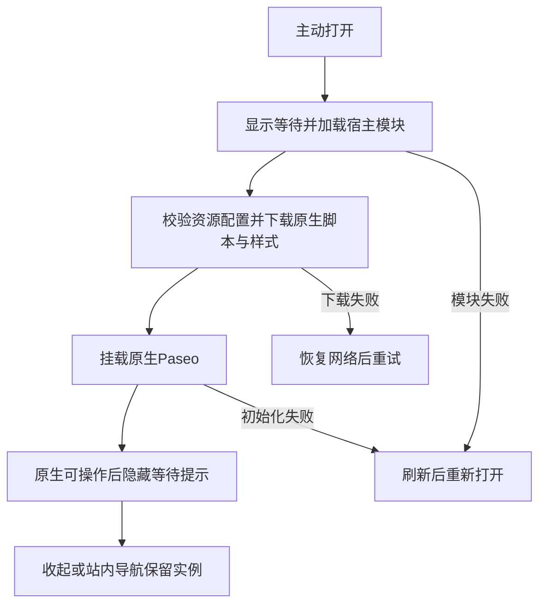

# 本地助手：打开、收起与继续浏览

## 一句话说明

维护者在明确启用H配置的隔离实验站，可以从Explore或作品页右下角打开原生Paseo，收起后继续阅读；普通构建没有助手入口，H尚未成为正式交付候选。

## 用户操作路径

1. 由AI按[系统说明](../system/local-assistant.md)准备固定版本资源及隔离同版daemon，打开本地H站的`/zh/`或`/en/`。
2. 点击右下角“本地助手”。首次点击才下载宿主模块和原生资源；等待中仍可收起。未启用JavaScript时显示启用提示，按钮不能操作。
3. 初始化完成后显示原生Paseo。隔离daemon同源服务能提供初始连接信息；配对、目录、会话、模型、聊天和权限操作继续使用Paseo自己的界面。连接成功不代表所有历史恢复或聊天操作已验收。
4. 点击“收起”返回浏览，焦点回到助手入口；站内换语言或作品页后再次打开，保留同一原生实例和会话。收起不停止本地Agent，也不销毁连接与缓存。
5. 资源下载失败时先恢复网络，再点“重试”；宿主模块加载失败、初始化失败或长时间未完成时使用刷新入口。刷新完成后助手保持关闭，再主动点击打开。
6. “退出并刷新”销毁当前网页运行环境并刷新，保留Paseo设备存储；它不等于停止本地任务、断开已保存设备或忘记设备。

阅读公开作品时，原生聊天输入框上方显示“附带当前作品”。点击后，标题、规范链接、可用的原作链接及简述作为引用资料进入原生输入框，可以查看和编辑；只有主动发送才提交。完整资料块可以点击“取消作品资料”移除，原来的输入保留。手动改写资料块后可直接在输入框删除，取消按钮不擅自删除改写内容。切换文章只更新可附带的作品，不覆盖已写好的草稿；草稿按原生会话/目录规则保存。

聊天进行中点击原生“停止 Agent”，会显示请求中、已获响应或结果未知；请结合会话状态核对，已经启动的子进程可能继续。停止提示不会把请求响应当作所有进程已结束。审批提交未收到确认时显示结果未知，等待连接与会话同步后再核对是否仍需处理，不自动重复提交；切到另一会话或开始新回合不会沿用旧停止提示。

桌面面板固定在右侧，窄屏占满视口，顶部保留收起和退出按钮。宿主提示跟随站点中英文；Paseo内部采用自己的翻译。文章正文与助手有独立滚动区域。网站搜索获得焦点时，助手快捷键不应抢占输入。

## 涉及的文件

- 入口与容器：`src/components/LocalAssistant.astro`、`src/layouts/Layout.astro`。
- 点击加载与生命周期：`src/scripts/paseo-boot.ts`、`src/features/paseo-webui/host.ts`。
- 公开资料与原生草稿：`src/features/paseo-webui/page-context.ts`、`third_party/paseo-webui/patches/h-public-work.patch`。
- 原生适配与构建来源：`third_party/paseo-webui/patches/series.json`及[系统说明](../system/local-assistant.md)。

## 验收标准

以下有效证据为2026-09-08的本地H生产导出、0.7.2隔离daemon与Playwright三配置；手机配置为模拟。日志及实际浏览器文章页截图在`resources/evidence/012-paseo-webui-loading/host/`。

- [x] 普通浏览和无JS不下载助手专用运行资源、不建立助手连接。
- [x] 重复打开、收起、换语言后保留一个挂载与连接；样式及页面不重载。
- [x] 离线首次打开、下载失败、404有可见恢复入口；加载中收起不会自动弹回。
- [x] 退出刷新后不自动打开、不改设备registry；320px容器适配及搜索焦点隔离通过。
- [ ] 真实iPhone后台、锁屏、切网与软键盘完整验收。
- [ ] 公开作品草稿、聊天/停止/审批、恢复及忘记设备的完整H验收。
- [x] 同版mock协议夹具验证停止响应、停止/审批断线结果未知、无自动重发、允许/拒绝和原生回合失败提示；不计真实模型重任务。
- [x] 公开作品资料可查看、取消，原生草稿跨文章/刷新保留；实际Luna收到标题并回复。
- [x] 本地Worker的实际CSP、官方TLS中继配对、已有会话恢复及禁止来源拒绝通过。
- [ ] 最终A/B选择、资源预算及上线验收。

## 对应的自动化测试

`tests/paseo-loading.spec.ts`覆盖上述加载、导航、离线、重试、退出、焦点与320px路径；必须显式指定`PASEO_HOST_URL`，否则跳过。`tests/unit/paseo-asset-contract.test.ts`校验资源路径和字段；既有`tests/paseo-mount.spec.ts`只验收G1探针，不替代H。

## 依赖的其他功能

- [浏览与搜索](explore-browse.md)、[阅读作品](article-read.md)。
- [检查与发布](project-commands.md)负责准备隔离资源；设备与原生运行边界见[系统说明](../system/local-assistant.md)。

## 已知问题 / 待办

H仅验证嵌入基础，不代表原生全部能力、恢复、语音或最终性能通过。未完成项以[012任务](../../specs/012-paseo-webui-loading/tasks.md)为准；缺少真机证据不能以模拟替代。尚未选定可正式发布的配置。作品资料只使用已发布元数据；不抓取原网站，不读取本地文件，不附带连接配置。

中继专项有效证据：2026-09-08，tests/paseo-csp.spec.ts三配置通过实际配对、历史、换语言、刷新恢复、原生JS/CSS MIME/不可变缓存及禁止来源拒绝。内置浏览器中gpt-5.6-luna经中继回复PASEO_RELAY_OK；不计最终重任务或完整恢复矩阵。

手机context现已显式继承项目的设备参数；早期中继记录未覆盖手机视口。扩大覆盖后发现并修正历史页保留初始连接错误的问题：2026-09-08，三配置的草稿/中继/延迟连接恢复9项通过。生产编译原因与修正前后证据见012 research R13；该基础恢复不替代完整100次矩阵。
