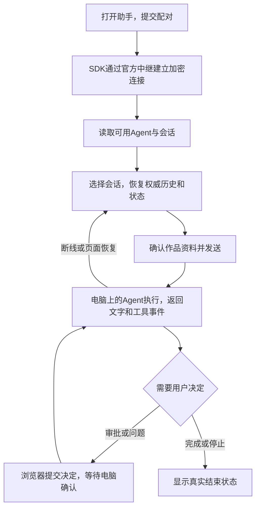

# 功能名：使用本地助手

## 一句话说明

访客在Explore打开助手，连接自己电脑的Paseo，把当前作品交给本地Agent讨论或执行任务，并在同一面板查看回复、处理审批、停止及恢复对话。

## 用户操作路径

1. 先在电脑按[官方Paseo说明](https://paseo.sh/docs)安装Paseo和至少一个支持的Agent，完成Agent登录，启动daemon并取得配对链接。电脑保持联网与唤醒；安装与兼容说明见[本地连接](../system/local-assistant.md)。
2. 手机或电脑打开Vibes的`/zh/`或`/en/`，点右下角“本地助手”。立即显示加载提示，首次此时才下载聊天组件。把官方v2配对链接或JSON粘贴进输入框，点击“连接电脑”；有效配对通过官方中继加密连接，成功后显示“已连接”。无效配对不联网，连接失败时检查电脑和网络后重试。
3. 默认只在当前标签页保存配对，刷新可恢复；需要以后继续使用时，在连接前勾选“在此设备记住电脑”。关闭助手只收起界面；“断开连接”保留恢复信息，电脑上的任务继续执行；“忘记电脑”断开并清除此浏览器的配对和会话索引。它不撤销其他设备、不删除电脑会话。
4. 点左上角侧栏按钮，在官方会话列表搜索或选择已有会话；标题下显示任务状态，“会话选项”显示Agent、模型和目录；或点“新建会话”，选择可用Agent、填写电脑上的完整目录路径、读取真实模型列表并选模型，再创建会话。列表为最近的至多200个活跃会话；独立启动、未由Paseo管理的桌面聊天不在接管范围。
5. 在作品详情打开助手，输入框旁显示作品来源标签。点击可核对标题、Vibes链接、原作链接和简介，点旁边移除按钮取消附带；“会话选项”可重新勾选附带；输入自己的问题后发送。切换作品会换成当前作品资料，首页没有作品资料。不自动抓取原站、整篇正文或电脑文件。
6. 在官方assistant-ui Thread中查看连续回复与可折叠推理，展开工具组和工具卡查看参数与结果。复制按钮复制已显示的回复；消息中的HTML不运行，图片只显示替代文字，外部链接需手动打开。工具在电脑执行，Vibes服务端不接收对话。
7. 遇到审批，在卡片核对真实工具/问题后选“允许本次”“拒绝”或填写回答；提交时等待电脑确认，不能重复点击。暂不支持的问题格式保留“拒绝”，也可到电脑处理。需要中断时点“停止”，收到电脑状态后才结束；运行或待审批期间不再发送新任务。
8. 页面刷新、断线重连或从后台返回时，先恢复电脑上的历史、运行状态和待审批再开放操作。“发送结果未确认”等提示出现时，先点“刷新状态”核对历史，再决定是否重新输入；浏览器不自动重发。更早记录每次读取200条，最多显示2000条，达到上限后可返回最新记录，完整历史仍在电脑。
9. 桌面显示官方AssistantModal，可点右上角按钮全屏；手机显示全屏弹层，侧栏使用官方Sheet；界面随站点中英文切换，用户文本和工具输出保留原文。按Escape或关闭按钮收起，键盘焦点回到入口。没有JavaScript时仍可浏览作品，助手显示需要启用JS的说明。

### 操作之后发生什么

## 涉及的文件

- 页面与入口：`src/components/AssistantHost.astro`、`src/layouts/Layout.astro`、`src/scripts/assistant-boot.ts`、`src/scripts/assistant-app.tsx`。
- 聊天与连接操作：`src/components/assistant-ui/`保留官方完整Elements源码及默认布局，`src/components/assistant/`为Paseo连接、会话、上下文及审批界面。
- 数据与状态：`src/lib/assistant/`，字段、恢复次序、兼容与容量见[本地连接说明](../system/local-assistant.md)。
- 作品资料来自`src/components/WorkDetail.astro`已发布的公开元数据，不增加后台内容接口。

## 验收标准

- [x] 2026-09-07真实Chromium UI连接Paseo0.5.0，新建Codex会话，读取隔离目录README并回答作品标题。
- [x] 2026-09-07真实Chromium UI停止运行任务；刷新及断开重连恢复同一会话。
- [x] 2026-09-07真实Chromium UI用官方审批分别拒绝、允许隔离目录写文件，核对拒绝未写入、允许后文件存在。协议夹具另验多问题/多选回答及结果未知保护；真实模型问题表单未触发。
- [x] 2026-09-07桌面、移动Chromium/WebKit及320px回归通过；内置浏览器在构建版复核桌面、390px布局及关闭焦点恢复。
- [x] 2026-09-07Cloudflare预览验证首次点击才加载、zstd压缩、同页复用和重启浏览器磁盘缓存；真实daemon连接及390px无横向溢出，数据见[加载测量](../../specs/011-local-paseo-assistant/research.md)。
- [ ] 真机iPhone Safari及手机断网/锁屏后的恢复验收通过。

真实证据为resources/evidence/011-local-paseo-assistant/official-final-browser.json及对应截图，检查配对/来源/工具/审批/忘记，浏览器未报告运行错误；创建、执行、停止及恢复见official-real-browser.json的已通过步骤。自动化设备模拟不等于真机通过。

## 对应的自动化测试

`tests/assistant.spec.ts`覆盖加密SDK配对、会话/模型/目录、公开上下文选择、文字/工具、审批允许/拒绝/多选、停止、拒绝发送、刷新、重连、中英文导航、忘记、320px和焦点。`tests/fixtures/assistant-daemon.ts`使用发布协议及官方加密实现模拟本地端，属于回归夹具，不是真实模型执行证据。

`tests/unit/assistant.test.ts`验证配对、存储、文本和工具归并；`tests/unit/assistant-store.test.ts`验证状态所有权、禁止重复执行、确认时机与重连。真实环境测试使用浏览器UI连接电脑daemon，去秘密证据保存在`resources/evidence/011-local-paseo-assistant/`，不向Git或PR上传凭据/私有对话。

## 依赖的其他功能

[浏览与搜索作品](explore-browse.md)、[阅读作品详情](article-read.md)。电脑端安装、登录和运行由Paseo与所选Agent提供。

## 已知问题 / 待办

真机Safari尚未验收。首版仅一个已配对电脑，采用粘贴配对，不提供相机扫码、终端、文件树、diff编辑器、语音、附件、编辑或重新生成。浏览器“忘记”只清本浏览器；对电脑访问权的撤销按Paseo官方机制处理。旧Agent CLI可能不能读取较新的本地配置，需要使用兼容版本，不能以daemon能连接推断模型一定能执行。
