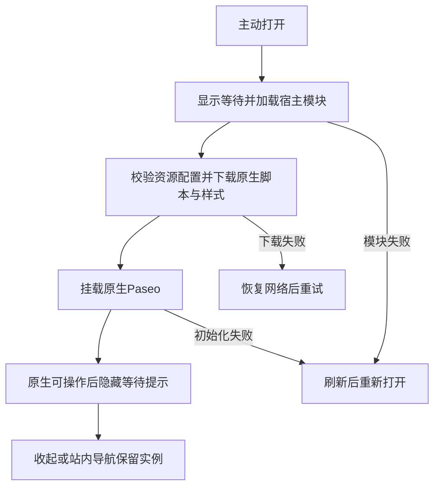

# 本地助手：打开、收起与继续浏览

## 一句话说明

维护者在明确启用H、A1、A2、A3或A4配置的隔离实验站，可以从Explore或作品页右下角打开原生Paseo，收起后继续阅读；普通构建没有助手入口，这些实验尚未成为正式交付候选。

## 用户操作路径

1. 由AI按[系统说明](../system/local-assistant.md)准备固定版本资源及隔离同版daemon，打开本地实验站的`/zh/`或`/en/`。
2. 点击右下角“本地助手”。首次点击才下载宿主模块和原生资源；等待中仍可收起。未启用JavaScript时显示启用提示，按钮不能操作。
3. 初始化完成后显示原生Paseo。隔离daemon同源服务能提供初始连接信息；配对、目录、会话、模型、聊天和权限操作继续使用Paseo自己的界面。连接成功不代表所有历史恢复或聊天操作已验收。
4. 点击“收起”返回浏览，焦点回到助手入口；站内换语言或作品页后再次打开，保留同一原生实例和会话。收起不停止本地Agent，也不销毁连接与缓存。
5. 资源下载失败时先恢复网络，再点“重试”；宿主模块加载失败、初始化失败或长时间未完成时使用刷新入口。刷新完成后助手保持关闭，再主动点击打开。
6. “退出并刷新”销毁当前网页运行环境并刷新，保留Paseo设备存储；它不等于停止本地任务、断开已保存设备或忘记设备。

阅读公开作品时，原生聊天输入框上方显示“附带当前作品”。点击后，标题、规范链接、可用的原作链接及简述作为引用资料进入原生输入框，可以查看和编辑；只有主动发送才提交。完整资料块可以点击“取消作品资料”移除，原来的输入保留。手动改写资料块后可直接在输入框删除，取消按钮不擅自删除改写内容。切换文章只更新可附带的作品，不覆盖已写好的草稿；草稿按原生会话/目录规则保存。

通过原生菜单的“历史”选择会话，或在项目列表选择已有工作目录；不同目录的草稿各自保留。点击输入框底部的模型名更换模型；桌面直接选择，手机先在设置面板点“模型”，选择后返回设置面板，再点右上角关闭。点击工具条目左侧图标查看参数、结果或错误；旁边的文件按钮会打开本地文件，是另一个操作。

A1—A4实验站中，Mermaid代码先显示源码，点击“查看图表”才加载渲染器；下载失败后可重试，源码仍可阅读和复制。图表显示后使用原生缩放及“查看源码”操作，回到图表或收起助手再打开会复用已加载资源。该行为已在A1—A3验证，H旧产物的图表尚未验收。

A2—A4面板实验站中，通过顶部“Workspace 操作”→“新建 Terminal”打开终端；通过“打开侧边面板”→“文件”选择文件，或点击聊天里的文件链接打开并定位。首次激活才下载对应实现，下载失败可重试；文件编辑沿用原生自动保存。收起助手保留面板，刷新后可以恢复已保存的布局与文件。A3中，源码切换预览会真正销毁编辑器画面，返回源码时仍保留草稿、光标及滚动位置；草稿的自动保存继续由原生模型负责。退出网页不会终止远端终端或Agent，重开会恢复终端输出。

A3/A4高亮探针先显示原文，当前可见内容稳定后再加载支持的语法；下载失败时原文和复制仍可用，点击重试恢复高亮。聊天代码、工具差异与文件编辑器共用语法资源；不支持的语言保持纯文本，原生超长内容保护保留。

A4语言实验站中，打开原生菜单→设置→通用→语言，选择九种支持语言之一；选择“系统”时，嵌入助手跟随网站语言。英文始终可用，其他语言首次使用才下载；下载失败保留当前语言或英文，底部提示可重试。快速切换后以最后选择为准，先前下载完成不会改回旧选择；翻译缺词使用英文。网站语言与助手语言各自设置。

聊天进行中点击原生“停止 Agent”，会显示请求中、已获响应或结果未知；请结合会话状态核对，已经启动的子进程可能继续。停止提示不会把请求响应当作所有进程已结束。审批提交未收到确认时显示结果未知，等待连接与会话同步后再核对是否仍需处理，不自动重复提交；切到另一会话或开始新回合不会沿用旧停止提示。

桌面面板固定在右侧，窄屏占满视口，顶部保留收起和退出按钮。宿主提示跟随站点中英文；Paseo内部采用自己的翻译。文章正文与助手有独立滚动区域。网站搜索获得焦点时，助手快捷键不应抢占输入。

## 涉及的文件

- 入口与容器：`src/components/LocalAssistant.astro`、`src/layouts/Layout.astro`。
- 点击加载与生命周期：`src/scripts/paseo-boot.ts`、`src/features/paseo-webui/host.ts`。
- 公开资料与原生草稿：`src/features/paseo-webui/page-context.ts`、`third_party/paseo-webui/patches/h-public-work.patch`。
- 原生适配与构建来源：`third_party/paseo-webui/patches/series.json`及[系统说明](../system/local-assistant.md)。

## 验收标准

以下有效证据为2026-09-08的本地H生产导出、0.7.2隔离daemon与Playwright三配置；手机配置为模拟。日志及实际浏览器文章页截图在`resources/evidence/012-paseo-webui-loading/host/`。

- [x] 普通浏览和无JS不下载助手专用运行资源、不建立助手连接。
- [x] 重复打开、收起、换语言后保留一个挂载与连接；样式及页面不重载。
- [x] 离线首次打开、下载失败、404有可见恢复入口；加载中收起不会自动弹回。
- [x] 退出刷新后不自动打开、不改设备registry；320px容器适配及搜索焦点隔离通过。
- [ ] 真实iPhone后台、锁屏、切网与软键盘完整验收。
- [ ] 公开作品草稿、聊天/停止/审批、恢复及忘记设备的完整H验收。
- [x] 同版mock三配置验证模型实际变更、目录/会话切换与草稿隔离、工具完成/失败详情，以及收起仍接收更新、恢复复用同一实例；页面前后台信号为受控模拟。
- [x] 同版mock协议夹具验证停止响应、停止/审批断线结果未知、无自动重发、允许/拒绝和原生回合失败提示；不计真实模型重任务。
- [x] 公开作品资料可查看、取消，原生草稿跨文章/刷新保留；实际Luna收到标题并回复。
- [x] 本地Worker的实际CSP、官方TLS中继配对、已有会话恢复及禁止来源拒绝通过。
- [x] A1本地生产站于2026-09-08通过三配置6项图表按需/重试/源码往返/iframe隔离测试；内置浏览器确认短图表与工具栏可读，证据在probe-mermaid/。
- [ ] 最终A/B选择、资源预算及上线验收。
- [x] A2于2026-09-08通过三配置18项图表/终端/文件测试及3项文件深链接定位；内置浏览器完成终端输入输出与文件实际自动保存。证据在probe-mermaid/。

## 对应的自动化测试

`tests/paseo-loading.spec.ts`覆盖上述加载、导航、离线、重试、退出、焦点与320px路径；必须显式指定`PASEO_HOST_URL`，否则跳过。`tests/unit/paseo-asset-contract.test.ts`校验资源路径和字段；既有`tests/paseo-mount.spec.ts`只验收G1探针，不替代H。

`tests/paseo-features.spec.ts`在A2检查图表、终端、文件保存与定位；`tests/paseo-resources.spec.ts`检查隐藏保留及退出网页后远端终端仍在。源码/预览往返另覆盖编辑器真实卸载后的草稿及位置。`tests/paseo-language.spec.ts`验证九语言按需、失败重试及迟到结果隔离；`tests/paseo-highlight.spec.ts`验证聊天、工具与文件共享、复制原文、超长工具内容及不支持的语法。需显式协议夹具配置；终端同时核对远端内容、画面非空及截图，不能仅凭加载提示消失判定已显示。

A3专项有效证据：2026-09-08，最终生产导出三配置48项通过，含功能、资源、高亮及经像素密度校准的终端；内置浏览器显示彩色代码并实际复制到系统剪贴板。更完整的最终配置、100次资源循环、真机和性能验收仍待完成。

## 依赖的其他功能

- [浏览与搜索](explore-browse.md)、[阅读作品](article-read.md)。
- [检查与发布](project-commands.md)负责准备隔离资源；设备与原生运行边界见[系统说明](../system/local-assistant.md)。

## 已知问题 / 待办

H仅验证嵌入基础，不代表原生全部能力、恢复、语音或最终性能通过。未完成项以[012任务](../../specs/012-paseo-webui-loading/tasks.md)为准；缺少真机证据不能以模拟替代。尚未选定可正式发布的配置。作品资料只使用已发布元数据；不抓取原网站，不读取本地文件，不附带连接配置。

历史列表沿用上游30秒查询缓存；由另一客户端刚创建的会话，可能不会立即出现在已打开过的列表中。完整刷新、断线和跨客户端恢复矩阵尚未完成。

中继专项有效证据：2026-09-08，tests/paseo-csp.spec.ts三配置通过实际配对、历史、换语言、刷新恢复、原生JS/CSS MIME/不可变缓存及禁止来源拒绝。内置浏览器中gpt-5.6-luna经中继回复PASEO_RELAY_OK；不计最终重任务或完整恢复矩阵。

手机context现已显式继承项目的设备参数；早期中继记录未覆盖手机视口。扩大覆盖后发现并修正历史页保留初始连接错误的问题：2026-09-08，三配置的草稿/中继/延迟连接恢复9项通过。生产编译原因与修正前后证据见012 research R13；该基础恢复不替代完整100次矩阵。

A4于2026-09-08的九项语言专项（三种模拟浏览器配置）通过；内置浏览器实际完成中英日切换。首轮联合专项有一项手机WebKit文件链接点击失败，后续11次鼠标诊断未复现，原因未确定，不据此宣称已修复。证据在probe-mermaid/a4-all-browser.json及a4-deeplink-*.log。

实际本地插件在A4原生设置中显示CSP禁止eval，客户端插件界面当前不可用；尚待确定接入范围。后端工具与已有聊天验收不能证明客户端插件可运行。最终联合专项另有一次创建测试工作区超时，见a4-final-browser.log，不能宣称整轮全部通过。
