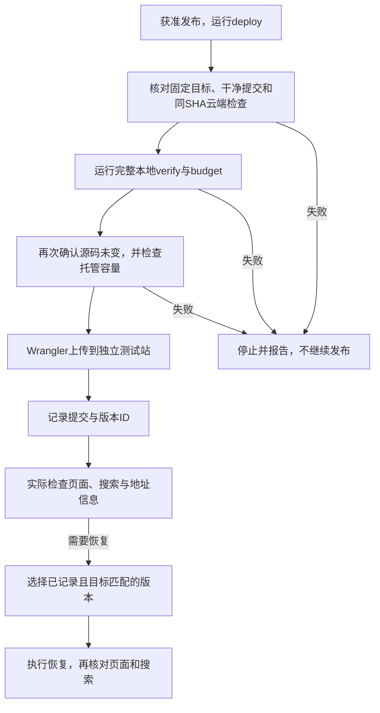

# 功能名：检查与发布网站

## 一句话说明

维护者检查一批网站改动，在获准后发布到独立测试站，发现问题时恢复已验证的版本。

## 用户操作路径

1. 在工作分支完成相关改动，按[CI规则](../operations/CI.md)选择检查；纯文档运行文档与格式检查，检查工具运行`npm run check`，网站变化运行`npm run verify`和`npm run budget`。
2. `verify`依次检查代码、重建本地测试库、运行浏览器测试；失败时看错误并修复，任何一步失败都不算通过。完整命令见[CLI](../operations/CLI.md)。
3. 必要时运行`npm run preview`人工查看，结束后关闭；测试专用4322端口必须空闲，不能复用可能来自另一任务的服务。
4. 一批相关工作准备好再提PR，查看verify/budget结果，由用户决定合并。commit、PR、合并和发布是不同动作。
5. 获得测试站发布授权后，确认提交、账户和地址；运行`npm run deploy`。它要求干净提交、同一SHA的GitHub检查成功，再执行完整本地检查和容量校验，通过后才部署。
6. 打开返回的测试地址，检查目录、搜索、详情、语言、旧链接、404和页面地址信息；命令成功不等于页面已验收。
7. 需要恢复时，运行`npm run release:restore -- <已记录版本ID>`，再核对页面与搜索；工具只接受目标匹配的本地已记录版本。
8. 收尾时核对并清理已合并分支和临时服务，保留commit历史；不会自动切换旧`vibes.college`域名。

### 操作之后发生什么

PR合并不会触发这条发布链路。恢复走单独命令，不重新构建当前源码；上传出现不确定结果时要先检查远端，不盲目重复发布。对应`scripts/release.ts`和`scripts/release-policy.ts`。

## 涉及的文件

- 命令和浏览器验收：`package.json`、`scripts/test-e2e.ts`、`playwright.config.ts`、`wrangler.local.jsonc`。
- 本地测试库：`scripts/database.ts`、`scripts/local-tools.ts`、`db/migrations/0001_local_test_records.sql`、`db/seed.sql`；表结构见[数据库](../technical/DATABASE.md)。网站不读取这个测试库。
- CI与发布：`.github/workflows/check.yml`、`scripts/check-scope.ts`、`scripts/release.ts`、`scripts/release-policy.ts`、`wrangler.jsonc`。
- 构建与容量：`scripts/build.ts`、`scripts/budget.ts`、`scripts/budget-policy.ts`、`scripts/asset-sizes.ts`。
- 地址与搜索引擎信息：`src/config/site.ts`、`astro.config.mjs`、`src/layouts/Layout.astro`、`src/pages/sitemap.xml.ts`、`src/pages/robots.txt.ts`。站点来源统一，canonical不含搜索参数，sitemap只列已发布路由，404禁止收录；不保证搜索引擎收录。

## 验收标准

- [ ] 所需检查全通过；类型、测试或构建失败时不继续发布。
- [ ] 本地库重建后样例正确；远程参数和额外参数被拒绝，不操作线上D1。
- [ ] 干净提交和同SHA检查门槛生效，发布只到指定独立测试地址。
- [ ] 页面、canonical、语言链接、sitemap和robots使用正确来源，不列草稿与不存在译文。
- [ ] 超出托管容量时阻断发布，不自动升级套餐。
- [ ] 恢复已记录版本后，页面与搜索都与该版本一致。
- [ ] 测试与预览结束后不留下无用服务。

本次只修改文档及文档检查工具，不执行发布/恢复或整站验收。历史证据：2026-09-05本地、GitHub与独立Cloudflare站发布及恢复演练通过，记录在`resources/evidence/001-multilingual-explore/cloudflare-release.md`。重复迁移命令与所有失败路径不因该记录而自动视作通过。

## 对应的自动化测试

- `tests/unit/check-scope.test.ts`：检查范围分类。
- `tests/unit/release-policy.test.ts`：同SHA发布门槛。
- `tests/unit/budget.test.ts`：体积和托管容量。
- `tests/unit/database.test.ts`：本地数据库规则和参数限制。
- `tests/unit/site-config.test.ts`：来源地址边界。
- `tests/explore.spec.ts`中的`metadata uses one origin and indexes only published language routes`：页面和搜索引擎元数据。

真实部署和恢复另做人工页面核对；测试工具不自动发布。

## 依赖的其他功能

- [规划开发与维护文档](document-governance.md)：维护检查需要的文档、规格与索引。
- [浏览与搜索作品](explore-browse.md)、[阅读作品详情](article-read.md)：发布后的验收路径。

## 已知问题 / 待办

- 当前没有CI自动发布，合并不会自动更新测试站。
- 5000件双语样例构建超过Workers免费档文件数上限；小样例站已部署不代表大目录容量已解决，见[容量规则](../technical/CONSTANTS.md)。
- GitHub分支保护状态需要平台核对，不能从CI通过推断已启用。
- `verify`会重建本项目的本地测试库；线上版本与最新main是否一致需发布时核对。
