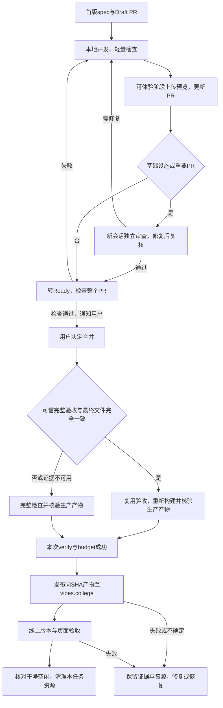

# 功能名：检查与发布网站

## 一句话说明

维护者从Draft PR查看进度与阶段预览，确认合并后由main检查和部署更新正式站，再由AI完成上线验收与清理。

## 用户操作路径

首次准备环境或修改原生补丁时，先按[Paseo构建路径](../system/local-assistant.md#重建与交付)准备固定上游和原生产物。普通build/verify会核对产物与当前源码补丁一致；不会默默拿旧包通过。仅本地对照可以关闭助手，发布构建必须包含。

1. 仅需要Spec Kit的需求使用PR；小修复、文档和小型规则补充按影响检查后直接提交，不单独开PR。远端保护限制见[发布规则](../system/checks-and-release.md)。采用Spec Kit时，AI在首版spec形成时建立Draft PR，给用户可打开的链接和任务摘要；当前进度、阻塞、下一步、预览范围放PR描述，重要决定和证据放评论。
2. 浏览器验收包含桌面Chromium与手机Chromium/WebKit模拟，真实iPhone另验；本地按[检查规则](../system/checks-and-release.md)验证；Draft云端运行独立check，不把跳过的verify/budget当作完成验收。阶段、交接和暂停前提交推送，不逐commit强制push。
3. 可体验阶段由AI运行`npm run release:preview -- <PR号>`：干净且已推送的PR head在本机verify/budget通过后上传预览版本，提供实际URL与SHA；不会提升生产。未跟踪的用户文件不删除，必要时用隔离worktree。
4. 基础设施或重要PR完成实现后，AI主动新建独立会话，让另一Agent审查整个PR，按实际风险检查功能是否正确、安全边界、性能与资源、代码是否易维护，以及测试和交付是否可信。问题修复并由审查者复核最终SHA后才转Ready，按整个PR差异运行verify/budget（文档和工具按范围缩减）；全部通过后通知你点合并。Ready之后再改代码须退回Draft、复核并重跑检查；具体范围见[独立审查规则](../system/checks-and-release.md#ready前的独立审查)。普通小改动保留按影响检查的路径，AI不自动合并。
5. 网站变更合并到main后，系统先核对最终全部文件是否与可信PR完整验收完全一致；有证明时复用验收结论，省去重复的完整浏览器和原生回归，仍重新构建Paseo及生产网站、运行基础检查、预算和产物核验。没有证明、内容变化、最新运行失败或证据查询异常则自动完整检查；Actions摘要显示路径及原因，无需手动选择。两条路径的verify/budget都成功后才部署本次main产物至`https://vibes.college`，拒绝过时版本。纯治理文档不重建网站；main仍按实际上线版本累计差异，避免漏发旧网页改动。
6. 云端核对线上SHA/摘要、中英文首页实际字节与CSP、Paseo脚本/样式的SRI和缓存，以及HTML预览载体的隔离策略；AI再用内置浏览器核对浏览、搜索、详情、语言与404，PR记录真实结果。失败或不确定状态停止收尾，保留恢复证据；不能将上传成功当作页面验收。
7. 需要恢复时使用`npm run release:restore -- <已记录生产版本>`，从CI artifact取回记录后核对目标与版本；首次切换前旧Worker保留，具体恢复路径见交付说明。
8. 上线验收后AI运行`npm run cleanup:task -- <PR号>`查看候选，确认无额外提交、无脏文件或其他任务占用，再执行清理；从待删除worktree之外执行，不切换其他任务的分支。收尾时同步空闲的本地主目录；有本地提交则保留并合并origin/main，没有则快进，冲突处理后按影响验证，不建立定时跟进。分支删除不删除Git历史或回滚版本。

### 操作之后发生什么

## 涉及的文件

- 检查和触发：`.github/workflows/check.yml`、`scripts/check-scope.ts`、`scripts/ci-policy.ts`；验收记录与可信判定：`scripts/ci-acceptance.ts`、`scripts/ci-acceptance-resolver.ts`、`scripts/ci-acceptance-policy.ts`。
- 发布：`scripts/release.ts`、`scripts/release-ci.ts`、`scripts/release-policy.ts`、`scripts/release-utils.ts`、`scripts/release-artifact.ts`、`scripts/release-preflight.ts`、`scripts/release-smoke.ts`、`wrangler.jsonc`。
- 清理：`scripts/cleanup-task.ts`、`scripts/cleanup-policy.ts`；服务占用由本机AI核对。
- 构建、容量和本地测试：`scripts/build.ts`、`scripts/optimize-images.ts`、`scripts/budget.ts`、`scripts/budget-policy.ts`、`scripts/asset-sizes.ts`、`scripts/test-e2e.ts`、`scripts/database.ts`、`scripts/local-tools.ts`、`playwright.config.ts`、`wrangler.local.jsonc`。
- 来源与静态元数据：`src/config/site.ts`、`astro.config.mjs`、`src/layouts/Layout.astro`、`src/pages/sitemap.xml.ts`、`src/pages/robots.txt.ts`；测试D1并非网站数据源，见[数据模型](../system/content-model.md)。

构建先把public/images中超过200KB的栅格图片生成到dist的WebP响应式变体和manifest，再为本地图片补充srcset；随后将固定2048素材打包为自包含沙盒模板，并生成全页共用的精确CSP脚本摘要；原始文件不被普通build改写。预算分别检查公共脚本、独立延后媒体模块、每篇MDX的完整额外模块和优化图片最大输出，包含延迟加载；媒体文件在内容校验时核对实际大小及数据。通过体积门槛不等于组件已在真机验收，具体限制见[规则](../system/rules.md)。

## 验收标准

- [x] Draft PR页面可见清单，阶段预览对应真实SHA并可操作。
- [x] Draft与Ready触发分离，分支push不重复CI；失败/旧SHA/产物漂移阻断发布。
- [x] 正式域名构建与来源校验通过，发布前保持明确目标和容量门槛。
- [x] 既有main完整检查后的自动发布实际成功，线上版本与页面验收通过，再执行清理。
- [ ] 可信复用、完整回退及单次Paseo准备通过最终本地/CI验证；首次合并后的快速生产部署另按实际记录验收。
- [x] 清理拒绝未合并、未上线、额外提交、脏文件/ignored配置/依赖PR，占用由AI核对声明；保护测试通过，保留恢复版本。
- [x] 本地D1只用于命令验收，拒绝线上参数；2026-09-05本地verify验证有效，网站不读取此库。

2026-09-06本地verify（52单元、26浏览器通过、2按设计跳过）、budget、Wrangler生产配置dry-run通过；专用worktreecheck再次通过。Draft运行34028631687通过；预览372ced7经ego-browser验证搜索、详情、语言切换及noindex，canonical指向正式域名；Ready运行34028923187和main运行34029233677全部通过；main合并提交bd34b7d已部署至vibes.college，2026-09-06实际浏览搜索、详情、语言与404通过，本任务分支/worktree已清理，证据和回滚版本保留。见[PR #3收尾记录](https://github.com/Vibes-college/Vibes/pull/3#issuecomment-5558821204)。历史证据在resources/evidence/001-multilingual-explore/cloudflare-release.md，仅说明旧流程当时通过。

多媒体交付验收：2026-09-07，release:preview在干净已推送源码上完成完整verify与budget、上传版本并核对发布SHA；内置浏览器实际播放预览中的Sintel并进入正文。该证据仅覆盖阶段预览，原始日志在resources/evidence/010-media-previews/release-preview.log，具体预览SHA和地址见PR #9；不代表main合并或正式网站已更新。

## 对应的自动化测试

- `tests/unit/ci-acceptance.test.ts`、`ci-workflow.test.ts`：同树证明、最新运行/attempt、Fork/跳过/缺失/错误回退及真实预算gate脚本。
- `tests/unit/release-smoke.test.ts`：版本、响应字节、CSP、SRI、MIME、缓存和沙盒策略。

- `tests/unit/check-scope.test.ts`：整个差异范围、未知路径与删除/改名。
- `tests/unit/delivery-git.test.ts`：真实Git覆盖累计main差异、ignored配置和目录/符号链接保护。
- `tests/unit/delivery.test.ts`：触发模式、生产事件与SHA、产物完整性、清理拒绝和经验/决策保护。
- `tests/unit/site-config.test.ts`、`tests/unit/budget.test.ts`、`tests/unit/database.test.ts`：origin、容量、本地库边界。
- `tests/reactions.spec.ts`：分章评价加载、保存、键盘、手机边界与动画清理。
- `tests/explore.spec.ts`：浏览、搜索、详情、语言、404、元数据与响应式。

## 依赖的其他功能

[规划开发与维护文档](document-governance.md)提供规格和handoff；上线验收走[浏览与搜索作品](explore-browse.md)和[阅读作品详情](article-read.md)。

## 已知问题 / 待办

合并、自动发布、线上体验和本机清理是不同状态；未发生的步骤不能提前勾选。旧CI没有新验收记录、记录过期或查询失败时会完整回退，不能保证每次合并都走快速路径；新快速部署的真实耗时以首次合并后的运行记录为准。GitHub main保护和production仅main准入已于2026-09-06实查配置，首次生产发布及收尾已按上述记录验证；以后每次发布仍须验收对应版本。5000件双语规模样例超过免费档文件数，小目录能上线不代表大目录容量已解决，不自动升级套餐。
