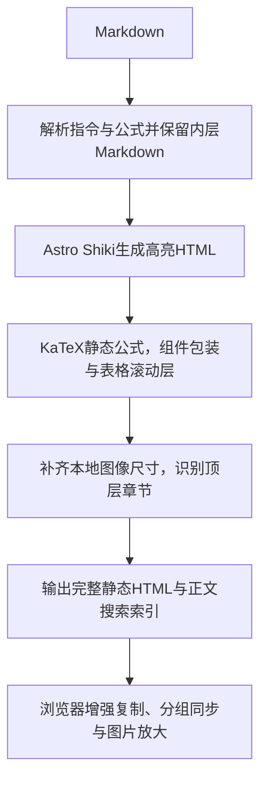

# Markdown正文排版

维护者通过[内容维护](../features/content-maintenance.md)编辑Markdown，访客操作见[阅读详情](../features/article-read.md)。完整可复制示例是[src/content/works/prose-ui-showcase/zh.md](../../src/content/works/prose-ui-showcase/zh.md)。文章使用普通Markdown与下列扩展指令，不使用MDX/React。

## 写一段组件内容

`:::组件{参数="值"}`开始容器，独立一行`:::`结束，中间可继续写Markdown。嵌套时外层冒号比内层多；表格、列表与结束标记之间留空行，避免标记成为内容。单行组件使用`::组件[内容]{参数="值"}`；句中图片使用`:image{...}`。

```markdown
:::callout{variant="tip" title="阅读提示"}
先看**完整示例**，再选择适合内容的形式。
:::

::::tabs{groupId="example"}
:::tab{value="说明"}
这里继续写Markdown。
:::
:::tab{value="例子"}
这里是另一个面板。
:::
::::
```

## 组件参数

| 组件               | 参数与默认值                                                                                                               |
| ------------------ | -------------------------------------------------------------------------------------------------------------------------- |
| subtitle / caption | 无属性，内容写在方括号或块内；caption放在frame中                                                                           |
| callout            | variant为note（默认）、info、tip、warning、danger；title可省略；也接受`> [!TIP]`等简写                                     |
| frame              | align为left（默认）、center、right、stretch；caption可写为属性或内嵌caption                                                |
| cards / card       | cards的columns为1–3，默认3；card必填title，可填icon、十六进制color、href、horizontal、cta、arrow；外链默认箭头及新标签打开 |
| steps / step       | steps的titleSize为base（默认）或h1–h6；step必填title，可填icon替代编号                                                     |
| tabs / tab         | tabs可填groupId；tab必填唯一value；相同groupId共享选择                                                                     |
| codegroup          | 可填groupId；每个代码块须有title，相同title按语言形成版本；同组每个文件都需提供全部语言                                    |
| image              | 必填src、alt，可填正整数width/height、zoom、href；独立图片默认zoom=true，行内默认false，链接优先于放大                     |

布尔属性接受不带值或`true`，明确关闭用`false`。Card图标来自`public/icons/prose/`的既有白名单；未知图标、属性、组件、枚举或危险URL会使构建失败。代码围栏支持`title="example.ts" showLineNumbers`，默认无标题、无行号；复制由浏览器增强。未知语法高亮语言沿Astro默认回退，不改变代码内容。数学使用`$行内公式$`或独立行`$$`块；KaTeX编译错误使构建失败。

本地图片放public，正文以`/images/...`引用。构建读取原始尺寸，只给宽或高时补齐等比例尺寸；外链图片不在构建时下载，应显式提供尺寸；图片内容策略允许HTTPS图源，浏览器直连来源。图片默认lazy与async解码；展示文章的Juno原图保持上游清晰度，文件较大，浏览器缓存复用。截图示例的图片、字体、图标许可证随静态资源保存。

## 编译顺序与浏览器行为



`npm run build`使用Astro官方`--force`清理内容编译缓存，避免插件或图片变化后仍复用旧HTML；开发服务修改编译插件后需重启。`src/lib/markdown/config.ts`配置官方unified处理器；remark-prose负责指令，rehype-prose负责最终结构与错误，rehype-image-size补本地尺寸。嵌套二级标题不进入大章节目录。原始HTML仅由受信维护者编辑；扩展属性白名单不等于公众输入消毒器，网站不开放投稿。

`src/lib/markdown/prose-style.ts`从已锁定的官方CSS读取样式，只把根级变量声明移到正文容器，避免覆盖网站外壳。`src/styles/prose.css`提供局部浏览器基础样式、滚动/交互适配、Geist与中文字体回退，以及用户指定的暖白#FCFBF8和暖灰#2E2B29；嵌套明暗样本保留上游变量，其他组件枚举与语义色保持原版。

`src/scripts/prose.ts`复用页面生命周期：相同组名同步选项，代码语言全篇同步；localStorage键为`prose-ui-code-lang`与`prose-ui-code-tab-{groupId}`。存储受限时当页可操作。复制失败保留可手选代码；图片原生dialog支持键盘/焦点与清理。禁用JS时全部面板展开，控件隐藏；公式、高亮、卡片和提示不依赖客户端框架。

## 验证

`tests/unit/prose-markdown.test.ts`运行真实Astro编译器，覆盖组件变体、属性/URL/公式错误、标题唯一性、图像比例与全文顶层章节；`tests/prose.spec.ts`覆盖复制和失败、文件/语言/标签同步、刷新、图片焦点、320px与无JS。完整发布仍遵守[检查与发布](checks-and-release.md)。
